# Documentation du plugin Jeedom Connect

Téléchargez l'application :  
  
  
si vous êtes bêta-testeur et utilisez la version bêta du plugin, [regardez-ici](#qBeta)  

Pour accéder à la TODO list [c'est par là!](todo.md)  

1. [Présentation du projet](#presentation)
2. [Fonctionnalités](#fonctionalites)
3. [Screenshots](#screenshots)
4. [Installation du plugin](#install)
5. [Configuration du plugin](#configurePlugin)
6. [Gestion des Widgets](#gestionWidget)
7. [Ajouter des équipements](#addEq)
8. [Configuration d'un équipement](#configureEq)
9. [Commandes disponibles sur un équipement](#eqCmd)
10. [Géolocalisation](#geoloc)
11. [Localisation](#localisation)
12. [Notification](#notification)
13. [Service d'arrière plan](#service)
14. [Reconnaissance vocale](#voice)
15. [Matching entre les versions Application (APK) <=> Plugin](#version)
16. [FAQ](#faq)

## Présentation du projet 

Le projet **Jeedom Connect** se compose de 2 parties : un plugin pour Jeedom, et une application Android / iOS.  

L'application utilise la plupart des éléments de navigation d'une application : un drawer (menu dépliable sur la gauche), un menu bas, un menu haut, et des listes accordéon. Tous ceux-ci sont personnalisables à partir du plugin.

La brique de base est la notion de *widget*, qui va représenter un "équipement domotique" (une alarme, une lumière, une info température...). Contrairement à l'application mobile officielle, Jeedom Connect n'ira pas chercher vos équipements / commandes pour vous les afficher directement. C'est à vous de définir un à un vos widgets. Ceci permet une flexibilité au niveau du rendu final.

Le plugin, ainsi que l'application sont complètement **gratuit** et le resteront. Je ne suis pas développeur et fais ça sur mon temps libre, relativement limité.
Si vous souhaitez **soutenir le projet**, vous pouvez suggérer des améliorations, signaler des bugs et contribuer au code du plugin si vous avez des notions de PHP/JS/HTML, ou de l'application si vous maîtriser le React Native.  
Pour celles et ceux qui tienent vraiment à soutenir financièrement parlant le projet :  
  

[plus d'infos](#qDon)

  

## Fonctionnalités 

- Affichage et gestion de vos équipements domotiques et des scénarios
- Affichage et gestion des caméras
- Historiques sous forme de graphique ou tableau
- Possibilité de sécuriser toutes les actions avec données biométriques
- Personalisation poussée de l'interface
- Notifications Push enrichies compatibles avec Ask
- [Géolocalisation](#geoloc) avec gestion avancée de la batterie (modes Geofencing et Tracking)
- Communication via le protocole WebSocket à faible latence, ou bien en HTTP
- Thème personalisable (couleur, mode sombre)

    

## Screenshots 

    

## Installation du plugin 

Il s'installe depuis le market comme les autres.  

La version beta contient les nouveautés les plus récentes. (A noter que cette version peut contenir des bugs et reste à privilégier pour des utilisateurs expérimentés).

    

## Configuration du plugin 

### Configurer l'accès à votre jeedom

Il y a plusieurs champs  pré-remplis que vous pouvez modifier. Des placeholder sont indiqués sur chacun d'entre eux. S'ils vous semblent corrects, inutile de les modifier.

- **Adresse http externe** : Indiquez ici votre adresse d'accès à Jeedom depuis l'extérieur de votre domicile.
- **Adresse http interne** : Adresse de Jeedom sur votre réseau local.
- **Activer la connexion par Websocket** : Indiquera à l'application si vous préférez utiliser le protocole Websocket pour la communication avec vos appareils. Notez tout de même que l'adresse HTTP est nécessaire au bon fonctionement de certains services (images persos, géolocalisation, actions sur notifications)
- **Port d'écoute du websocket** : Sauf si vous avez une application qui utilise ce port, vous n'avez pas besoin de le modifier. En cas de modification, n'oubliez pas de redémarrer le démon.
- **Adresse externe websocket** : Adresse websocket accessible depuis l'extérieur (nécessite une configuration de votre réseau)
- **Adresse interne websocket** : Adresse websocket sur votre réseau local

Si vous modifiez un de ces champs, il faudra bien sûr sauvegarder, puis re-générer les QR Code des équipements. En cas d'utilisation du HTTP, il faudra aussi redémarrer l'appli.
 

### Personnaliser le plugin

Vous avez la possibilité de personnaliser le chemin d'accès à vos images/icônes.  
Par défaut, les images personnalisées du plugin sont stockées sous `plugins/JeedomConnect/data/img/user_files/`.  
  
Vous pouvez choisir d'utiliser un autre emplacement en renseignant le champ `Chemin pour les images perso` le chemin d'accès au répertoire qui contient vos images et icônes personnels.  
:warning: Le chemin ne dois PAS contenir la racine

> par exemple, si vous souhaitez utiliser le répertoire `/var/www/html/data/img/` alors indiquez : `data/img/` dans le champ  (attention au dernier `/`!)

 

### la Zone des Dangers

Les actions disponibles dans cette partie sont à utiliser avec précaution. Vous pouvez en effet perdre l'intégalité de vos configurations si vous ne faites pas attention à ce que vous faites.  

- **Réinitialiser** : efface les configurations de l'ensemble de vos équipements. Vous devrez donc redéfinir quels sont les widgets que vous souhaitez avoir sur chacun de vos équipements  
- **Supprimer** : remet à 0 l'intégralité du plugin. Vous perdrez TOUTES vos configurations et l'ensemble de vos widgets seront supprimés. (comme si vous installiez le plugin pour la première fois)  
- **Lister** : permet d'obtenir la liste des widgets (id) :
  - non-utilisés : existant mais rattaché à aucun équipement
  - non-existants : présent dans le fichier de configuration d'un équipement, mais non créé sur le plugin (mauvaise migration par exemple)
  - tous : liste le nombre de fois où un wigdet est utilisé (format => "widget ID" : "nombre d'utilisation")  
- **Exporter**/**Importer** : permet d'extraire l'ensemble de la configuration des widgets, et les réimporter sur une autre instance jeedom  
- **Migrer** : transforme les fichiers de configuration dans le nouveau format attendu du plugin  

    

## Page principale du plugin JeedomConnect   

La page principale du plugin se décompose en deux parties :

1. Sur la partie haute, vous pourrez voir et gérer [vos équipements](#addEq) (appareil muni de l'application JeedomConnect)
2. Sur la seconde partie : vous aurez accès à l'ensemble de [vos widgets](#gestionWidget) et pourrez les modifier à souhait.

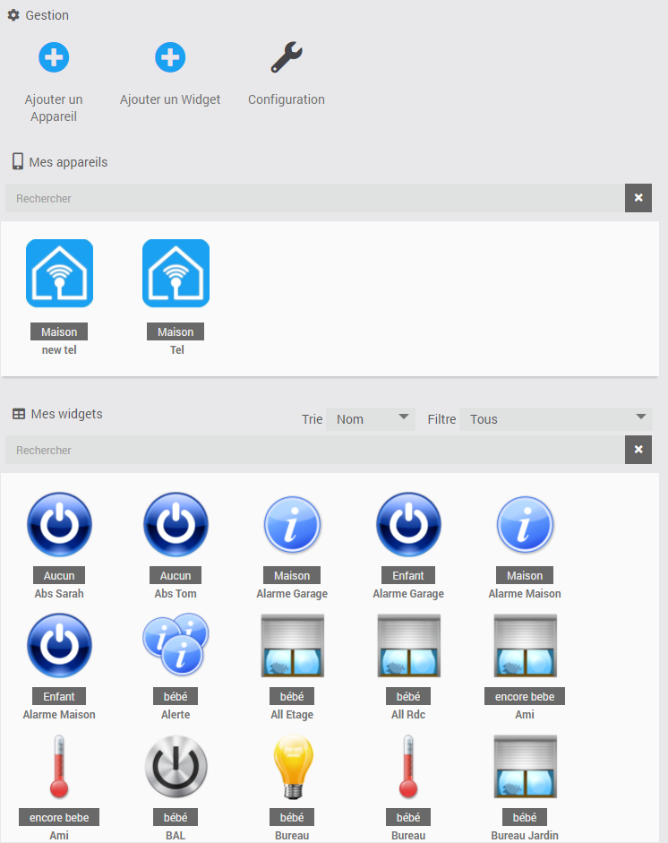

    

## Gestion des widgets 

Il est nécessaire de commencer par créer un widget pour ensuite pouvoir le rattacher à un (ou plusieurs) équipement(s).  
Sur la page principale vous avez accès à l'ensemble des widgets que vous avez créé. Il est possible de les filtrer par type et de les classer (par Pièces, Nom, ou Type).  

Pour créer un widget, cliquez sur "Ajouter un widget", sélectionnez ensuite le type de widget que vous souhaitez créer dans la liste déroulante de gauche puis renseignez les différents champs affichés à l'écran avant de finaliser la création en appuyant sur le bouton "Sauvegarder".  

Quelques éléments sont standard et seront demandés pour l'ensemble des widgets :  

- **Actif** : Le widget sera (ou pas) affiché dans l'application. Pratique si vous voulez par exemple gérer un groupe de lumières, mais ne pas afficher certaines d'entre elles.
- **Pièce** : Sélection de la pièce associée (identique aux objets gérés dans Jeedom)
- **Nom** : Nom du widget
- **Sous-titre** Information complémentaire affichée dans l'application. Le mode personalisé permet de mettre une phrase quelconque, ou un texte dynamique
- **Affichage forcé** : De façon standard, chaque widget (sauf exception) possède 3 types d'affichage : carte, vignette et détail. Les affichages carte et vignettes peuvent être choisis via l'icône en haut à droite dans l'application. L'affichage détail est une page entière affichée quand on click sur le widget. Vous pouvez ici forcer un widget à s'afficher d'une de ces 3 façons.  
   Attention pour le mode détail, le widget doit être seul sur sa page.
- **Sécuriser les actions** : Toutes les commandes de type action peuvent être sécurisées à l'aide de ces trois boutons :  
     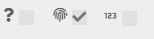
   Le premier permet de faire une simple demande de confirmation de l'action.  
   Le second demande une donnée biométrique (empreinte digitale, reconaissance faciale) pour exécuter l'action (sur appareils disposant d'un capteur).  
   Le dernier demandera le mot de passe configuré dans les paramètres de l'équipement JC.  
- **Images** : Les images de l'application sont stockées dans le dossier `plugins/JeedomConnect/data/img/`. Si vous souhaitez ajouter des images persos, utilisez l'assistant, ou bien copiez vos images dans `plugins/JeedomConnect/data/img/user_files/`. Il est conseillé d'utiliser des images PNG en 128x128. Vous pouvez aussi mettre des GIF animés.
- **Images sous conditions** : Vous pouvez dans certains widgets définir une image en fonction des valeurs d'une commande. L'ordre des ces conditions sera prise en compte par l'appli (les plus hautes sont prioritaires).  
- **Ajouter des infos** : vous permet d'ajouter des commandes de type `info` de votre Jeedom et de vous en servir pour les autres champs du formulaire 'Images sous conditions', 'Nom', 'Sous-titre'.

**Textes dynamiques** : Les champs `Nom` et `Sous-titre`, ainsi que les conditions d'affichage d'images peuvent être personnalisés. Ils sont évalués dans l'application en JavaScript. Les raccourcis suivants sont aussi disponibles (liste non exhaustive mais disponible dans la configuration de chaque widget côté plugin) :

- `#room#` : Nom de la pièce associée au widget
- `#status#` ou `#value#` (selon les widgets) : donne la valeur courante de la commande info principale du widget
- `#formatedValue#` (selon les widgets) : valeur formatée en mot de la commande info princpale (par exemple `Allumé`, `Eteint`)
- `#elapsedTime#` : durée depuis laquelle la commande info principale du widget a été modifiée
  Exemple :
  `La lumière de #room# est formatedValue depuis elapsedTime et consomme power W`  
   pourra donner :  
   `La lumière de jardin est allumée depuis 1h12min et consomme 15W`  

Les fonctions suivantes sont également dispobibles, pour une commande info notée ici #cmd# :

- `time(#cmd#)` : durée depuis laquelle la commande info principale du widget a été modifiée
- `date(#cmd#)` : date et heure de dernière modification de la valeur,, au format "DD MMM - HH:mm"
- `collect(#cmd#)` : date et heure de dernière collecte de la valeur,, au format "DD MMM - HH:mm"
- `average(#cmd#)` : moyenne des valeurs de la commande (#cmd# doit être historisée)
- `min(#cmd#)` : minimum des valeurs de la commande (#cmd# doit être historisée)
- `max(#cmd#)` : maximum des valeurs de la commande (#cmd# doit être historisée)
- `tendance(#cmd#)` : renvoie `up`, `down` ou `stable` selon la tendance des valeurs (#cmd# doit être historisée)
- `modifiedDate(#cmd#)` : donne le timestamp en ms de la dernière modification
- `collectDate(#cmd#)` : donne le timestamp en ms de la dernière collecte

De plus, pour la manipulations des dates, vous avez accès à la bibliothèque `momentjs` ([documentation](https://momentjs.com/docs/#/displaying/)). Exemple :

`` `La tondeuse est {#cmd# > 0 ? "en marche" : "au repos"} depuis le moment(modifiedDate(#cmd#)).format("DD MMMM à HH-mm")` ``
pourra donner :
`La tondeuse est au repos depuis le 30 Septembre à 13:31`
(notez l'usage des backquote qui entourent le texte)

La duplication d'un widget est réalisable dès que celui-ci a été sauvegardé une première fois. Cliquez simplement sur le bouton "Dupliquer", réaliser vos modifications (ou pas), et enregistrer (impérativement) en validant avec le bouton "Sauvegarder".  

La suppression est également possible. Attention toutefois, si un widget est supprimé, alors il disparaitra de l'ensemble des équipements auxquels il avait été ajouté !  

- ### Widgets disponibles  

|  |  |  |
|------|-----|-----|
|Alarme|Caméra|Climatiseur|
|Favoris|Fenêtre|Générique actions|
|Générique binaire|Générique message|Générique numérique|
|Générique slider|Générique switch|Générique texte|
|Géolocalisation|Groupe d'alarmes|Groupe de fenêtres|
|Groupe de génériques binaires|Groupe de lumières|Groupe de PIR|
|Groupe de portes|Groupe de prises|Groupe de volets|
|Humidité|Liste de choix|Lumière à variation|
|Lumière de couleurs|Lumière On/Off|Luminosité|
|Mode|PIR|Portail coulissant|
|Porte|Prise|Puissance|
|Résumé|Résumé de pièce|Scénario|
|Température|Thermostat|Volet|
|Web View|Historique|Image|

    

## Ajouter des équipements 

Vous pouvez ajouter des équipements dans le plugin de façon standard.

1 équipement = 1 appareil muni de l'application

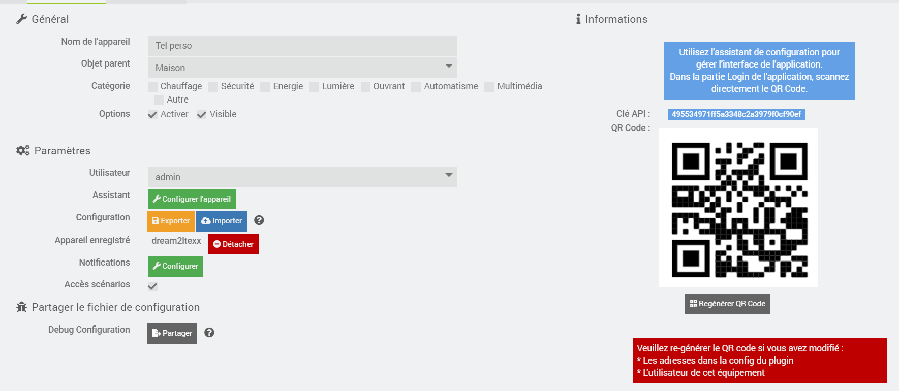

A la création d'un équipement, une clé API, ainsi qu'un QR Code est automatiquement généré avec les informations de configuration du plugin. Lors du démarrage de l'application, vous pourrez alors entrer manuellement vos identifiants jeedom, ou bien scanner le QR Code. Une fois connecté, l'équipement et l'appareil sont liés. Pour vous connecter avec un autre appareil, il vous faut le *détacher*  en cliquant sur le bouton associé.

La configuration d'un équipement consiste en un fichier JSON configurable avec l'assistant, et que vous pouvez exporter / importer. Si vous voulez par exemple cloner un équipement, ajoutez en un nouveau et utiliser l'exportation / importation.  

Le dernier bouton permet lui de transmettre votre fichier de configuration complet, en cas de problème, au développeur. Ce fichier ne DOIT PAS être importé sur un autre équipement JeedomConnect.  

    

## Configuration d'un équipement 

La configuration du contenu de l'application se passe dans l'assistant.

Le changement de configuration a lieu à chaque click sur le bouton *Sauvegarder*. Si l'application est démarrée, elle est automatiquement transférée (websocket uniquement). Vous pouvez recharger la configuration dans l'appli en appuyant sur le logo du 'menu hamburger'.  
Si vous pensez avoir une erreur avant d'avoir sauvegardé (par exemple supprimé un élément par erreur), actualisez simplement la page. Le bouton *Réinitialiser* (suivi de *Sauvegarder*) remet toute la configuration à zéro, attention donc !

   

- ### Menu du bas

Cette partie est assez explicite, elle permet de configurer les onglets qui apparaissent en bas de l'écran. Vous avez la possibilité de choisir vos icônes parmis tout un panel : celles de Jeedom, celles proposées par Material Design, ou encore sur Font Awesome(un moteur de recherche est intégré).  
La configuration de cette partie est optionnelle, et n'est à réaliser que si vous souhaitez utiliser ces onglets.

    

- ### Menu du haut

 

 Cette partie est également explicite. Un menu sous forme d'onglets en haut de l'écran que vous pouvez 'slider'. Egalement facultatif.

    

- ### Pièces

 Chaque widget peut être associé à une pièce à ajouter dans cette partie.  Chaque pièce correspond à un objet Jeedom.  

    

- ### Résumés

 Vous avez la possibilité de choisir les résumés Jeedom que vous souhaitez rappatrier sur l'application JeedomConnect.  
 Depuis l'onglet 'Résumé', vous pourrez :

- Ajouter un résumé, après l'avoir sélectionné dans la liste déroulante  
- Importer l'ensemble des résumés existants (le bouton est caché si vous avez déjà tous les résumés dans l'application)

  

Il vous est ensuite possible de cliquer sur chaque résumé pour personnaliser les icônes et leurs conditions d'affichage.  
  

Deux variables sont disponibles : `#value#` et `#total#` :  

- `#value#` correspond à la donnée du résumé remontée par Jeedom (nombre de volets ouverts par exemple)
- `#total#` correspond au nombre total de commandes rattachées à ce résumé (nombre de volets total sur le résumé par exemple)

    

- ### Widgets

 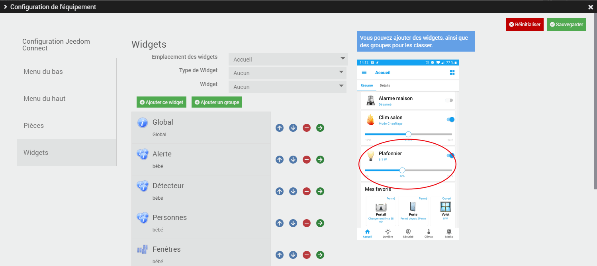
 Définissez d'abord l'emplacement où placer le widget : sur quel menu / sous-menu que vous voulez le configurer.
 Vous pouvez ensuite filtrer sur le type de widget que vous allez ajouter (ne sont proposés que les types de widget déjà créés).  
 Sélectionnez le widget que vous souhaitez ajouter, puis enfin cliquez sur le **Ajouter ce widget** pour l'ajouter à votre configuration.  

- **Ajouter un groupe** : Vous pouvez ranger vos widgets dans un menu dépliable (type "acordéon").  
  - **Actif** : Le groupe sera (ne sera pas) affiché dans l'application.
  - **Développé par défaut** : Le comportement par défaut (plié / déplié) du menu.  
  

 Différentes actions sur possible sur chaque élément :  
 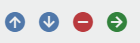  

- les flèches bleues permettent de monter ou descendre le widget par rapport aux autre widgets sur la même page. Elles permettent aussi de faire entrer ou sortir un widget dans un groupe  
- le moins rouge permet d'enlever le widget de la page (ça ne supprime pas le widget dans Jeedom)
- la flèche verte (vers la droite) permet de déplacer le widget sur une autre page  

    

## Commandes disponibles sur un équipement 

Par défaut les commandes suivantes sont disponibles dans chaque équipement.  
Les infos :  

- `Batterie` : Permet de connaitre le % de batterie de votre appareil. L'information est remontée si l'application est ouverte ou si le service est activé
- `Position` : Lorsque la géolocation est activée, donne les coordonnées GPS de l'appareil sous la forme `latitude,longitude`. Il est aussi possible d'ajouter l'altitude, l'activité et la batterie en cochant la case correspondante dans les paramètres de l'équipement.
- `Activité` : Lorsque la géolocalisation est activée, donne l'activité en cours sur l'appareil. LValeurs possibles : ``still``, ``on_foot``, ``running``, ``on_bicycle`` et ``in_vehicle``.
- `Etat écran` *[Android, Service]* : Binaire qui permet de connaître l'état allumé / éteint de l'écran
- `En charge`  *[Android, Service]* : Binaire qui permet de savoir si l'appareil est en charge
- `Etat Bluetooth` *[Android, Service]* : Binaire qui permet de savoir si un périphérique bluetooth est connecté
- `Etat Wifi` *[Android, Service, Localisation autorisée & activée]* : Binaire qui permet de savoir si l'appareil est connecté à un réseau wifi
- `Adresse IP` *[Android, Service]* : Lorsque l'appareil est relié au réseau wifi, indique l'adresse IP
- `Réseau wifi (SSID)` *[Android, Service, Localisation autorisée & activée]* : Lorsque l'appareil est relié au réseau wifi, indique le nom du point d'accès
- `Visage présent` *[Android]* : indique si un visage est détecté devant l'écran de l'équipement
- `Volume actuel` *[Android, Service]* pour connaitre les 6 différents volumes de son appareil (en fonction des OS et surcouche). La commande est valorisée par défaut avec l'ensemble des volumes disponible, selon le format suivant : `Alarme;Appel;Musique;Notification;Sonnerie;Système;`
- `Prochaine alarme` *[Android, Service]* : permet de récupérer (au format timestamp) l'heure de la prochaine alarme
- `Package Prochaine Alarme`*[Android, Service]* : permet de savoir quel est le package qui déclenchera la prochaine alarme sur votre téléphone

Les actions :

- `Notification` : Commande de notification par défaut
- `Afficher page` : Lorsque l'application est en premier plan, permet de basculer sur une page donnée. Il s'agit d'une commande action message. Pour l'utiliser, commencer par repérer l'`id` de la page. Cell-ci est disponible en survolant votre souris sur les menus de l'assistant de configuration. Indiquez alors cet `id` dans le champs `Id page` de la commande.
- `Lancer App` *[Android]* : Lorsque l'application est en premier plan ou que le service est activé, permet de lancer sur votre appareil une application. Il s'agit d'une commande action message qui accepte dans son champs ou `Nom de l'application` le nom du package de l'application. L'autorisation système `Superposition sur d'autres applis` doit être activée (Android >= 10)
- `Détacher` : Permet de détacher l'appareil de l'équipement.
- `Notifier les appareils JC` : Permet d'envoyer un même message à plusieurs appareils. (cf la configuration plus bas !)  
- `Pop-up` : Permet d'afficher un pop-up sur votre appareil. Elle sera affichée directement dans l'application si celle-ci est ouverte, et sinon en popup système *[Android seulement]*.
- `Modifier Préférences Appli` : Permet de modifier certaines options de votre application. Faites un choix dans la liste déroulante, puis indiquez la valeur à mettre si nécessaire : `ON`, `OFF`, `MARCHE`, `ARRET`
Liste des actions (fonctionnent même appli tuée) :
  - `Schéma thème` : entrer l'id du schéma à appliquer
    

    
Liste des schémas

      jeedomConnect,    material,    materialHc,    blue,    indigo,  hippieBlue,
    aquaBlue,    brandBlue,    deepBlue,    sakura,    mandyRed,    red,   redWine,    purpleBrown,    green,    money,    jungle,    greyLaw,    wasabi,    gold,    mango,    amber,    vesuviusBurn,    deepPurple,ebonyClay,    barossa,    shark,    bigStone,    damask,    bahamaBlue,
    mallardGreen,    espresso,    outerSpace,    blueWhale,    sanJuanBlue,
    rosewood,    blumineBlue,    reactDash,    materialBaseline,    verdunHemlock,    dellGenoa,    customColors
    

  - `Activer mode sombre` : `ON`, `OFF` ou tout autre chose pour le mode auto
  - `Activer le tracking` : `MARCHE` ou `ARRET`
  - `Recharger les données`
  - `Service JC` *[Android]* : `ON`, `OFF`, permet d'activer / désactiver le service.
- `Envoyer un SMS` *[Android, Version APK sur git uniquement]* : Permet d'envoyer un SMS.
Champ `Titre` : numéro du destinataire.
Champ `Message` : contenu du SMS.
Cette fonction est utilisable dans n'importe quel état de l'application (premier-plan, arrière-plan, tuée)
Pour utiliser cette fonction, vous devez d'abord vous rendre dans les autorisations de l'appli puis accepter celle correspondant à l'envoie de SMS.
- `Allumer l'écran` *[Android]*
- `Eteindre l'écran` *[Android, définir JC comme appli d'administration]* : Cette action requiert que l'application Jeedom Connect soit définie en tant qu'`Appli d'administration du système` (généralement dans la section `Sécurité` des paramètres de votre appareil).
- `Jouer un son` *[Android, Service]* : Permet de lire un fichier audio sur l'appareil. Indiquez une URL complète, ou bien un chemin absolu sur votre installation Jeedom (par exemple `/var/www/html/data/bip-bip.mp3`), ou bien le chemin d'un fichier local sur votre appareil (par exemple `file:///storage/emulated/0/Music/file.ogg`)
- `TTS` : Permet d'utiliser la fonction `Text to Speach` de votre appareil pour lire un texte. Sur iOS, l'application doit être ouverte
- `Mode sonnerie` *[Android]* : Permet d'activer un mode de sonnerie `Silencieux`, `Normal` ou `Vibreur`. Dans le champs `Titre` de la commande, indiquez l'un des mots clé `silent`, `normal`, `vibrate`. Pour Android N et supérieur, l'application a besoin de l'autorisation `Accès au mode "Ne pas déranger"`.
- `Modifier Volume` : Permet de régler le volume de l'appareil (en %). Pour Android, vous pouvez spécifier en plus dans champs `Titre` de la commande le canal audio à modifier, parmi `music`, `call`, `system`, `ring`, `alarm`, `notification`.  
- `Commande shell` *[Android]*, **[Root]** : Si votre appareil possède les privilèges root, permet d'exécuter n'importe quelle commande. A la première utilisation, votre gestionnaire de `Super utilisateur` vous demandera l'autorisation.
  

  
Exemples de commandes

  
  - Lancer une activité : `su -c am start -n com.jeedomconnect.app/.MainActivity`  
  - Activer / désactiver le bluetooth : `su -c service call bluetooth_manager 6` (changer 6 en 8 pour désactiver)  
  - Activer / désactiver le wifi : `su -c svc wifi enable` (changer enable en disable pour désactiver)  
  - Redémarrer l'appareil : `su -c reboot`  
  

  

## Géolocalisation 

Jeedom Connect dispose d'une fonction de Geofencing : définissez des lieux géographiques sur une carte et des commandes binaires seront créées dans votre équipement vous indiquant si l'appareil est dans ce lieu ou pas.

Commencez par ouvrir l'application et rendez-vous dans les Préférences puis activez la géolocalisation.  

Pour le bon fonctionnement du service, il est impératif d'accepter toutes les autorisations, en particulier la `Localisation` doit être sur `Toujours autoriser` (Android 10+)

Vous pouvez ensuite aller sur `Gestion des lieux`.

- Pour **définir une zone**, faites un appui long sur la carte puis donner un nom et un rayon (en mètres). Le binaire est immédiatement créé côté Jeedom.
- Pour **supprimer ou éditer une zone**, appuyez sur le marqueur puis sur le nom qui apparait.
- Pour **déplacer une zone**, faites un appui long sur le marqueur puis glisser.
Jeedom Connect possède aussi une fonction de Tracking qui vous permet de connaitre à tout moment la position de votre appareil. Les coordonnées GPS (latitude,longitude) sont accessibles dans la commande `Position` de votre équipement.  

 

Ces actions peuvent également être réalisées depuis le plugin, en utilisant la petite `cible` sous votre équipement, ou via le bouton `Personnaliser les Geofencing` sur la page de configuration de votre équipement JC :  

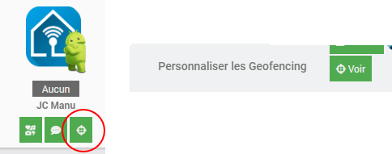
    

Vous arrivez sur une nouvelle fenêtre qui vous donne accès à 2 infos :  

- la 1ère partie concerne les zones utilisées pour faire du geofencing déjà disponible sur votre équipement. Ces zones sont représentées en vert sur la carte.  
- La 2nd partie, permet de voir toutes les zones qui ont été créées sur le plugin et qui peuvent être partagées entre différents équipements (ce qui évite d'avoir à recréer une zone "Maison" sur tous les appareils !). Ces zones sont représentées en rouge sur la carte.  

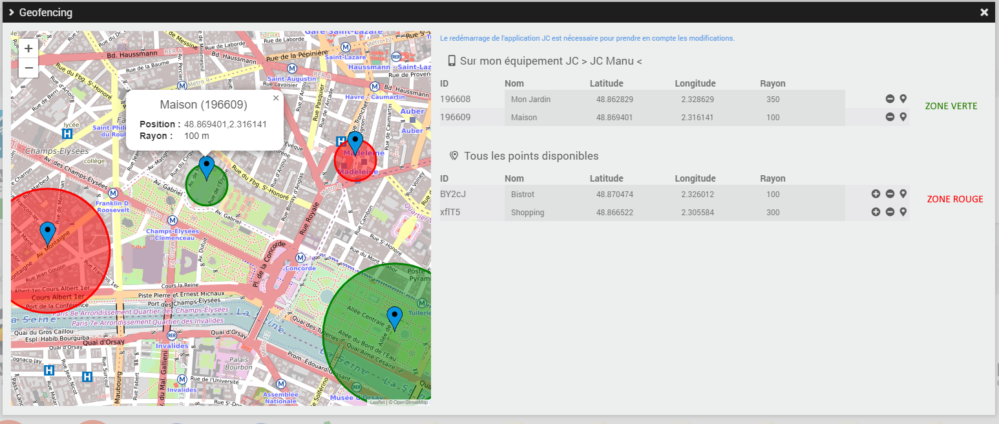

### Comment ajouter une zone ?

Cliquez sur la carte à l'endroit où vous désirez créer une zone puis sur le bouton `Créer une zone ici`. Celle-ci sera automatiquement ajoutée dans la partie `Tous les points disponibles`. Pour l'ajouter à votre équipement, il vous suffit de cliquer sur le petit `+` en bout de ligne, ce qui aura pour action de déplacer cette ligne sur votre équipement et de créer la commande correspondante dans votre équipement.

### Comment supprimer une zone de mon équipement ?

Cliquez sur l'icône `-` en bout de ligne, la zone est supprimée :

- de votre équipement, si c'est un point de la partie 'Mon équipement'
- de la configuration, si c'est un point de la partie 'Tous les points disponibles'. Dans ce dernier cas, cette zone ne sera plus proposée pour configurer un autre équipement.

### Comment centrer ma carte sur une zone ?

Cliquez simplement sur le dernier icone en forme de `pin`, la carte se centre automatiquement sur ce point

### Comment déplacer une zone ?

Les petits pin bleus utilisés pour caractériser la zone peuvent être déplacés. Cliquez sur le point à déplacer, allez au nouvel endroit désiré, relachez la souris, voilà le point est déplacé !  
Si vous connaissez les coordonnées GPS du nouveau point, vous pouvez également directement les saisir dans le tableau de droite, et la zone se mettra également à jour.

    

## Localisation 

Il est possible de suivre la localisation de vos équipements JC.  
Pour cela :

- l'option de tracking doit être activée sur votre application JC, de façon à ce que votre position soit remontée au plugin
- sur chaque équipement (sur le plugin), vous devez cocher la case `Afficher la position sur la carte globale` (et vous avez la possibilité de personnaliser le repère utilisé sur la carte pour identifier cet équipement)

Ensuite il suffit de cliquer sur le bouton `Localisation` disponible sur la page principale du plugin pour accèder à la carte.

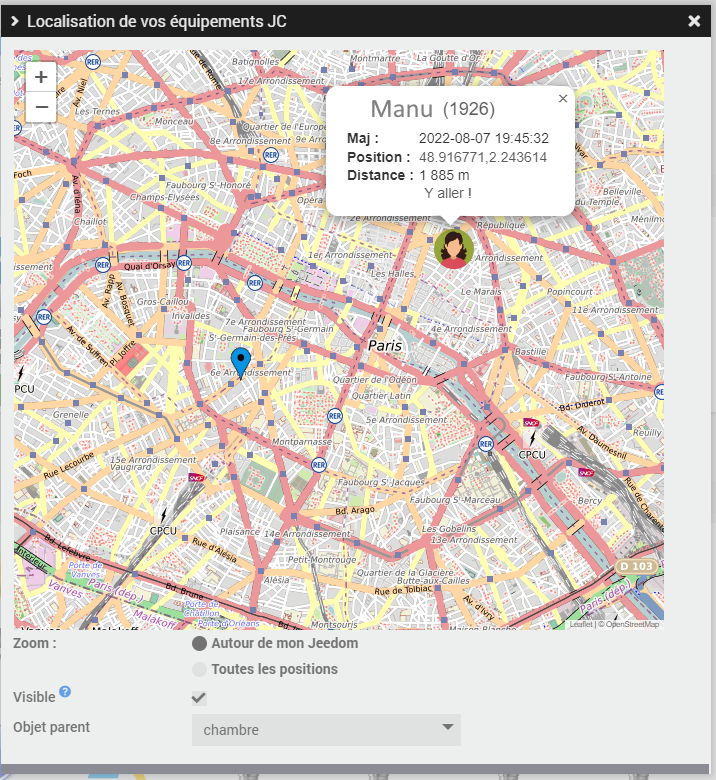

Cette même carte peut être affichée sous forme de widget (au sens Jeedom du terme). Pour se faire, vous devez cocher la case `Visible` sur cette fenêtre, et sélectionner sous quel objet le widget devra être affiché.  

En cliquant sur les icônes présents vous aurez accès à plus de détails sur la position : le nom, la dernière mise à jour, les coordonnées, la distance entre ce point et votre jeedom (cf la page de configuration du plugin) et un lien pour rejoindre directement cette position.

    

# Notification 

Vous avez la possibilité de gérer différents types de notifications sur l'application Jeedom Connect. Ces notifications peuvent être utilisées comme vous le feriez déjà avec l'envoi par Jeedom d'un SMS, Telegram, et autres sortes de messagerie.  
Vous pouvez donc vous envoyer des notifications (via des scénarios par exemple) : lorsque votre porte d'entrée s'ouvre alors que vous êtes absent, pour vous prévenir de sortir la poubelle, indiquer que le facteur est passé, ... vers votre application JeedomConnect.

## Les Canaux  

Dans le paramétrage des notifications, vous avez la possibilité de créer plusieurs canaux.  
Ces canaux permettent de définir différentes façon de réagir qu'aura votre smartphone à la réception d'une notification JeedomConnect.  

<u>Par exemple</u> depuis le plugin, vous pourriez créer un canal `Défaut`, un `Silence` et enfin un `Urgent` (propre à chaque équipement).
Ces canaux sont ensuite disponibles sur votre application mobile JeedomConnect. Faites un clic long sur l'icone JeedomConnect, puis 'informations', ensuite allez dans le menu 'notification' : vous devez alors voir les 3 canaux précédemment créés `Défaut`, `Silence` et `Urgent`.  

Vous pouvez alors les personnaliser : (toujours <u>en exemple</u>)

- le canal `Silence` recevra toutes les notifications pour lesquels je ne souhaite pas être dérangé : donc je choisis de ne pas avoir de son
- la canal `Urgent` par contre il faut absolument que je lise les notifications au plus vite, du coup je choisis une sonnerie bien particulière (je peux augmenter également le son), et je choisis l'option 'Ignorer ne pas déranger'

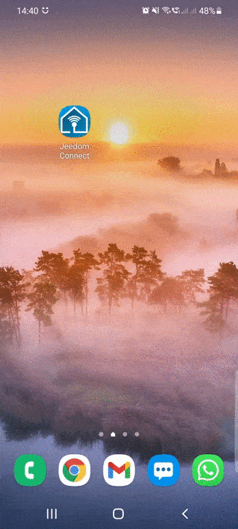  

## Les notifications

Il faut ensuite créer les commandes notifications qui auront un lien avec nos canaux.
Dans l'onglet `notification`, (toujours en partant de <u>l'exemple</u> donnée au dessus), je crée donc 3 notifications : `notification` (créé automatiquement) en lien avec le canal `Défaut`, `notif silencieuse` que je lie au canal `Silence`, et `notif urgente` que je rattache au canal `Urgent`.  
Vous pouvez également :  

- mettre à jour l'existante : si cochée, alors vous ne verrez qu'une seule notification du même type dans votre barre de notification sur votre smartphone. (si décochée, chaque notification sera affichée)
- couleur : définit la couleur du titre de la notification sur votre smarphone, ainsi que celle de la notification
- image : permet d'ajouter une image sur le coin en haut à droite de la notification
- actions : permet de réaliser commandes et/ou scénario à chaque fois qu'une notification est envoyée. (<u>par exemple</u> : si envoi d'une notification urgente, je veux avoir la possibilité d'exécuter le scénario qui permet de déclencher l'alarme de la maison)

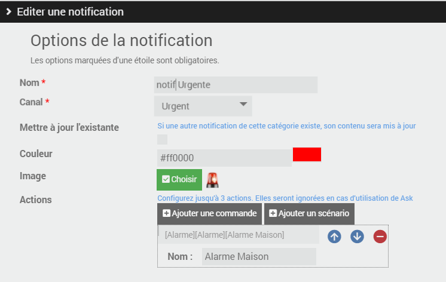  
 
   
### Comment envoyer une notification ?

Une fois que vous avez paramétré vos différentes notifications, les commandes associées sont automatiquement créées sur votre équipement (après `sauvegarde`), dans l'onglet dédié comme sur tout équipement Jeedom :  
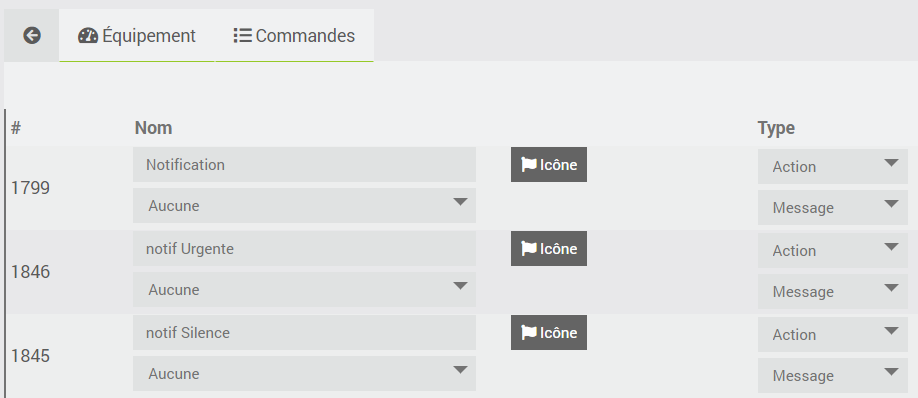  

vous pouvez donc vous en servir dans un scénario ou n'importe quel autre type (interraction, bloc code, ...) :
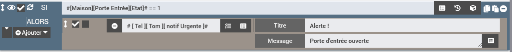  

Voici par exemple la réception d'une notification : (avec les configurations présentées précédemment, ça reste donc toujours qu'un exemple possible ! )

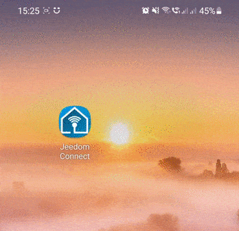  

C'est une `notif Urgente` qui a été envoyée, donc puisque la notification est paramétrée sur le canal `Urgent`, mon téléphone sonne donc avec un fort volume même si je suis en mode 'ne pas déranger'.  
La notification est affichée en rouge dans la barre de notification Android, ainsi que lorsque je la visualise en entière dans l'application JeedomConnect, et on voit la présence d'un icône 'sirène rouge' dans le coin supérieur droit.
Et j'ai également la possibilité de cliquer sur le bouton `Alarme maison` pour exécuter le scénario que j'ai paramétré et qui déclenchera l'alarme de ma maison.

 
 
### Comment envoyer une notification à tous les appareils ? 
 

Par défaut le fait d'envoyer à "tous" les appareils JC n'existe pas.  
En effet, il est possible de configurer plusieurs types de notifications par appareil, il nous est donc impossible de deviner lesquelles sont à utiliser.  
Vous pouvez créer plusieurs notification de type `Notifier tous`, il faut :

- aller sur la page principale du plugin et sélectionner sur `Notification multiples`
- cliquer sur `ajouter` pour créer un nouveau type de notification (on peut par exemple imaginer avoir un `Notifier les parents`, `Notifier les enfants`, `Notifier toute la famille`)
- selectionner l'ensemble des notifications qui devront être utilisées lorsque l'action sera réalisée
- sauvegarder les modifications pour ne pas les perdre
- Lors de la sauvegarde, une nouvelle commande est automatiquement créée sur chaque équipement qui ont été coché

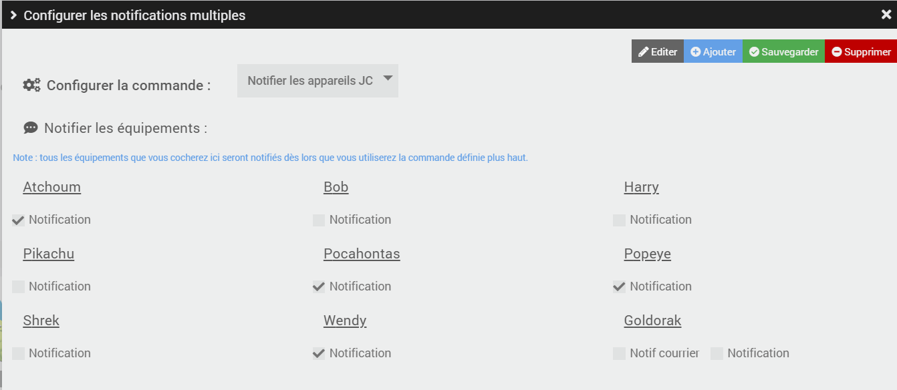  

 
   

### Quelles sont les options possibles dans les notifications ?  

Vous avez la possibilité de passer quelques options dans les notifications sous la forme `clé=valeur`, chaque option doit être séparé par un `|` :

- `title` : permet de donner un titre à la notification (c'est l'option qui est prise par défaut si jamais vous n'indiquez aucune option)
- `gotoWidgetId` : permet d'afficher un bouton sur la notification qui vous redirige directement sur un widget
- `gotoPageId` : permet d'afficher un bouton sur la notification qui vous redirige directement sur une page
- `files` :  permet d'envoyer des images/fichiers (! il faut indiquer le chemin complet pour aller sur le fichier)

par exemple : `title=y'a du courrier | gotoPageId=10 | files=/var/www/html/data/img/courrier.png`  
permettra d'avoir une notification ayant comme titre "Y'a du courrier", une image sera présente et un bouton permettra d'aller sur la page ayant l'id = 10 de votre application.
 
   

### Utilisation avec Ask

Les notifications Jeedom Connect sont compatibles avec la fonction Ask de Jeedom. Vous pouvez indiquer autant de réponses souhaitées, ou bien attendre une réponse tapée en texte libre directement dans la notification. Il est également possible de définir un timeout au delà duquel il n'est plus possible de répondre.

 
   

## Envoyer des images

Il est possible d'envoyer des images aux notifications (par exemple des shot de caméras). La première image sera visible dans la notification Android directement. Pour accéder aux autres il faut se rendre dans la page de notification de l'application.

    

# Service d'arrière plan (Android seulement) 

Jeedom Connect dispose d'un service qui tourne en tâche de fond et permet une communication permanente entre votre appareil et le plugin, **quelque soit l'état de l'application** (premier plan / arrière plan / tuée).
Le service s'active dans les préférences de l'application `Service et actions / Gestion du service`.

Lorsque le service est activé, une **notification permanente** est affichée dans le volet des notifications (il s'agit en réalité selon la terminologie Android d'un service d'avant plan - cette notification est imposée par Android et n'est donc pas masquable).
Vous pouvez personnaliser cette notification :

- en modifiant le titre
- en modifiant le message
- en affichant, ou pas, l'icône de l'application (dans le contenu de celle-ci)

Le service Jeedom Connect a principalement deux utilités :

- Remonter les **informations** sur l'état de l'appareil vers Jeedom
- Aider à l'exécution d'**actions** sur l'appareil

Ces **informations** et **actions** sont décrites dans la section [Commandes disponibles sur un équipement](#eqCmd).

Pour remonter les informations, le service utilise des **déclencheurs** qui sont des événements du système. Vous devez activer les déclencheurs qui vous intéressent pour que la remontée ait lieu.
A chaque fois qu'un événement lié à un déclencheur a lieu, **toutes** les informations sont remontées vers Jeedom.

:warning: Activer trop de déclencheurs peut nuire au niveau de votre batterie !

*Exemple* : Si la seule information qui vous intéresse concerne l'état du wifi (activé / adresse IP / point d'accès), alors vous pouvez uniquement activer le déclencheur `Connectivité changée`.

## Liste des déclencheurs disponibles

- `Périodique` : se déclenche automatiquement toutes les X minutes
- `Démarrage de l'appareil` : se déclenche à chaque fois que l'appareil démarre (**après** avoir saisi d'éventuels moyens de sécurité)
- `Connectivité changée` : se déclenche lorsqu'un changement dans la connection au réseau a lieu (par exemple passer du réseau mobile à un réseau Wifi)
- `Chargeur branché`
- `Chargeur débranché`
- `Batterie faible` : se déclenche lorsque le niveau de batterie devient faible (généralement <= 15%)
- `Batterie OK` : se déclenche lorsque le niveau de batterie revient à un état normal (généralement > 15%)
- `Ecran éteint`
- `Ecran allumé`
- `Bluetooth connecté` : se déclenche dès que l'appareil est connecté à un périphérique bluetooth.
- `Bluetooth déconnecté` : se déclenche lorsqu'il n'y a plus aucun périphérique bluetooth connecté.
- `Prochaine alarme changée` : se déclenche lorsque la date ou l'heure de la prochaine alarme programmée sur l'appareil change

    

# Reconnaissance vocale 

L'application utilise le moteur principal configuré sur votre appareil pour la reconnaissance vocale. Si aucun moteur n'est installé sur votre appareil Android, vous pouvez [installer celui de Google](https://play.google.com/store/apps/details?id=com.google.android.googlequicksearchbox&hl=en).
Il existe deux méthodes pour activer la reconnaissance :

- A l'aide du bouton de la barre du haut (Accessible depuis le menu Préférences/Reconnaissance vocale)
- A l'aide d'un mot clé (hotword) à prononcer

Pour activer la détection de mots clés, un assistant vous guide dans l'application.

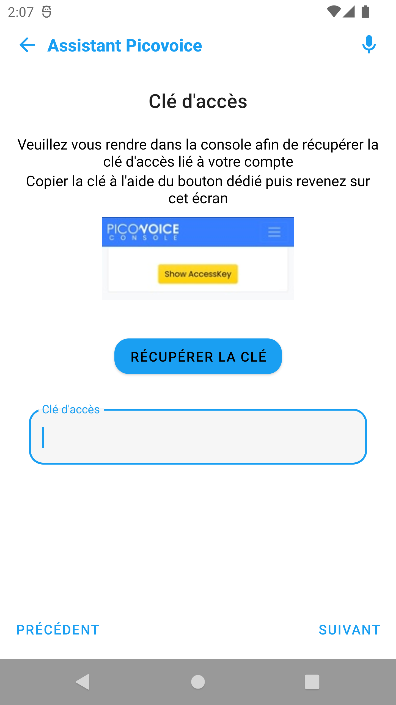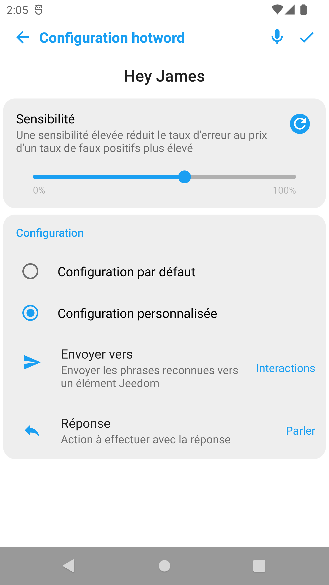

Il est nécessaire de créer un compte gratuit chez [Picovoice](https://picovoice.ai/). Un compte permet :

- de créer 3 hotwords par mois (toutes plateformes confondues)
- d'utiliser la détection sur 3 appareils différents

Il est possible de créer autant de compte gratuit que vous le souhaitez.
Une fois le compte créé, vous vous rendrez sur la [console](https://console.picovoice.ai/) pour :

- Récupérer la `clé d'accès` et l'enregistrer dans l'application
- Créer vos hotwords personnalisés

Chaque mot clé est 'entraîné' par l'IA de Picovoice et est spécifique à une langue et une plateforme (Android ou iOS).
Une fois créé, vous les téléchargez directement sur votre appareil et indiquez à l'appli le fichier `.zip`.

Pour le bon fonctionnement, tous les hotwords doivent avoir la même langue (et la même plateforme de destination).

Chaque hotword peut avoir sa propre configuration, réglage de la sensibilité, destination vers Jeedom (Interaction, Commande message ou Scénario) et traitement de la réponse.

La détection fonctionne dans les cas suivants :

- Application ouverte et en premier plan
- Android et service d'arrière plan activé

# Matching version Application (APK) <=> version Plugin sur Jeedom 

:warning: Ces informations sont obsolètes depuis la version 0.18.2.  
Dorénavant, les applications sont disponibles au téléchargement directement et uniquement depuis le Store.  

  
Ancienne version/méthode

  L'apk est téléchargeable en cliquant sur le numéro de version.

## Version Stable

  |Version plugin |Version Application  |
  |------|-----|
  |0.17.1 (15/03/2021 11:14:23)|[0.17.1](https://github.com/jared-94/JeedomConnectDoc/raw/master/resources/apk/stable/JeedomConnect-0.17.1.apk) |
  |0.16.0 (22/02/2021)|[0.16.0](https://github.com/jared-94/JeedomConnect/releases/download/0.16.0/JeedomConnect-0.16.0.apk) |

     

## Version Beta

  |Version plugin |Version Application  |
  |------|-----|
  |0.18.1 (2021-03-17 10:23:20) | [0.18.0-beta](https://github.com/jared-94/JeedomConnectDoc/raw/master/resources/apk/beta/JeedomConnect-0.18.0-beta.apk)  |
  |0.18.0 (15/03/2021 11:27:31) | [0.18.0-beta](https://github.com/jared-94/JeedomConnectDoc/raw/master/resources/apk/beta/JeedomConnect-0.18.0-beta.apk)  |
  |0.17.1 (05/03/2021) | [0.17.1-beta](https://github.com/jared-94/JeedomConnect/releases/download/0.17.1/JeedomConnect-0.17.1-beta.apk)  |
  |0.17.0 (04/03/2021) | [0.17.0-beta](https://github.com/jared-94/JeedomConnect/releases/download/0.17.0/JeedomConnect-0.17.0.apk)  |

     

## Lien github générique

  <https://github.com/jared-94/JeedomConnect/releases/latest>

    

# FAQ 

- [Comment télécharger l'application ?](#qOU)
- [Quelle est la différence entre connexion HTTP, Websocket et Polling ?](#qConnexion)  
- [L'application m'indique "Cet équipement utilise un ancien format de configuration. Veuillez effectuer la migration"](#qMigration)
- [J'ai l'erreur suivante "Cette application requiert une version plus récente du plugin"](#qVersion)
- [Je suis bêta-testeur, que dois-je faire ?](#qBeta)
- [Je ne vois pas la batterie d'un de mes équipements sur JC, pourquoi ?](#qBattery)
- [Comment « vider le cache » ou « supprimer les données » ?](#qVideCache)
- [Quelles différences entre l'édition et la personnalisation d'un widget ?](#qEditCustom)
- [Lors de ma première utilisation une pop-up me demande de "Sélectionner une application de l'écran d'accueil", que dois-je faire ?](#qSetLauncher)  
- [Mon téléphone reste "bloqué" sur JeedomConnect. Comment retirer le mode launcher ?](#qLauncher)
- [Comment configurer le widget Caméra ?](#qCamera)
- [J'ai un message "A lire" qui n'arrête pas de s'afficher. Comment le masquer définitivement ?](#qWarning)
- [Comment paramétrer les zones de Geofencing ?](#configGeofence)
- [Comment voir les positions de mes appareils JC ?](#localisation)
- [Les cartes de geofence et de localisation sont centrées sur Paris par défaut, comment changer ?](#qCarteParis)
- [Comment formater une date/heure dans les widgets ?](#qDatetime)  
- [J'ai un message "Address already in use" au démarrage du démon, comment faire ?](#qAddressUsed)  
- [Je trouve l'application géniale ! Comment vous aider ?](#qDon)
- [Je ne trouve pas de réponse à mon problème dans la doc. Que faire ?](#qForum)

---

## Comment télécharger l'application ? 

L'application est disponible sur vos Store :
  
  

 

## Quelle est la différence entre connexion HTTP, Websocket et Polling ?   

Avec Jeedom Connect, il est possible d'établir la connexion entre votre appareil et le plugin de deux façons différentes :

- **Http** : Au lancement de l'application, une connexion Http de type Source Event Server est établie avec le plugin. Cette connexion est persistente mais uni-directionnelle : de Jeedom **vers** votre appareil. Les actions de votre appareil vers Jeedom sont des requêtes Http uniques utilisant le protocole JSON RPC.
Ce mode de connexion ne necéssite aucune configuration particulière.
- **Polling** : Lorsque les états ont du mal à être rafraichi, vous pouvez utiliser cette option. Ici c'est l'application qui lance une connexion vers le plugin pour forcer la récupération des informations de façon régulière. Cette option est plus que conseillée lorsque vous utilisez les DNS Jeedom (incompatible avec `websocket`).
- **Websocket** : La connexion websocket est quant à elle bi-directionnelle. Elle nécessite néanmoins une configuration de votre réseau pour être utilisée en dehors de votre réseau local. Il est possible de faire une redirection de port sur votre routeur (méthode simple) ou bien de configurer votre serveur proxy ou le serveur Apache de votre Jeedom (utilisateurs avancés, incompatible avec `polling`).

Le Websocket offre une connexion **plus stable et plus performante** que la connexion Http.

 

## L'application m'indique "Cet équipement utilise un ancien format de configuration. Veuillez effectuer la migration"   

La migration était une étape nécessaire lors de l'utilisation de la version 0.18.0, elle n'est donc plus à utiliser.  
Si vous voyez cette erreur, c'est que le fichier de configuration de votre équipement est corrompu (mauvaise manip, mauvais import, .. ). Récupérez une ancienne sauvegarde de Jeedom et dézipper-là pour restaurer le fichier de configuration en question (disponible dans `plugins/JeedomConnect/data/configs/<apiKey de l'équipement>.json` )

Ancienne méthode

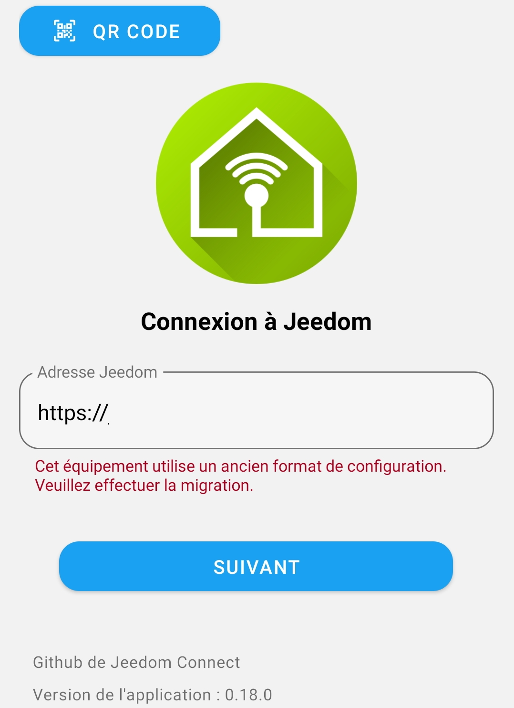  

La mise à jour que vous venez de réaliser nécessite une mise à jour au niveau du fichier de configuration utilisé pour définir vos widgets.  
Que va faire cette opération ? Elle va lire votre(vos) fichier(s) de configuration et créér automatiquement tous les widgets correspondant.  
:warning: si vous avez plusieurs équipements (téléphone/tablette/...) de configurés, il y a de forte chance que l'opération créé des widgets en doublon (ou plus).  
Deux choix s'offrent à vous :  

  1. migrer UN seul de vos équipements (appareils), exporter sa configuration puis l'importer sur tous vos autres équipements :  
      - le + : pas de widgets créés en doublon, pas de longue suppression manuelle à réaliser
      - le - : si certains de vos appareils ont des widgets bien à eux, il faudra alors les recréer manuellement  
  2. migrer l'ensemble de vos équipements :  
      - le + : tous les widgets seront créés automatiquement
      - le - : chaque équipement étant migré comme s'il était seul, certains widgets seront créés en doublon. Vous aurez donc besoin de faire un peu de ménage en modifiant les configurations de certains équipements puis en supprimant les widgets inutiles en doublon.

Nous préconisons la solution #1 ! Voici comment nous vous proposons de faire :

- commencer par mettre le niveau de log en `DEBUG` sur l'application (page `configuration` du plugin, pensez à sauvegarder !)
- désactiver l'ensemble de vos équipements sous le plugin JeedomConnect, et n'en laisser qu'<b>UN SEUL actif</b> (le plus utilisé, ou celui qui contient le plus de widgets)
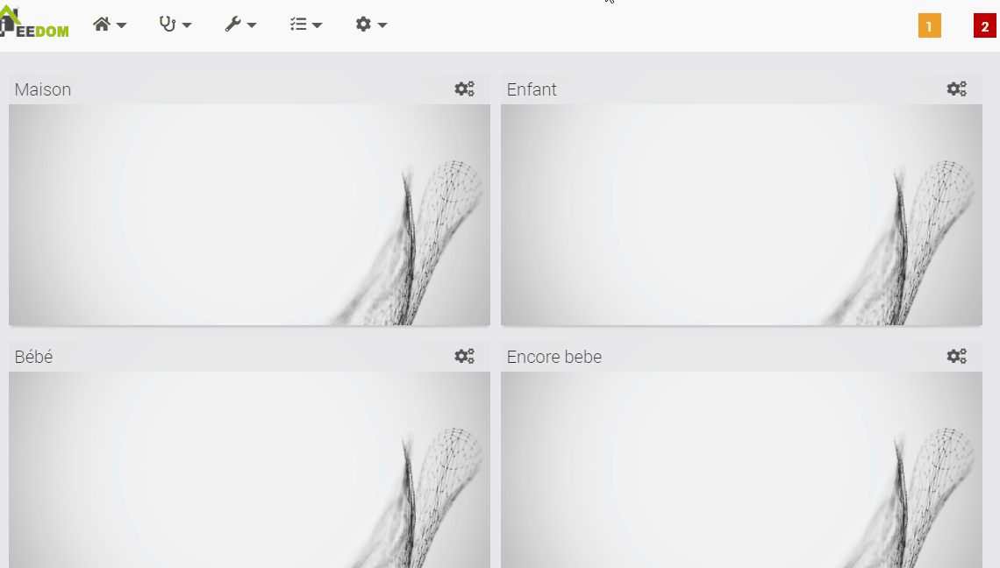  

- rendez-vous sur la page `configuration` de votre plugin (Menu `Plugins/Gestion des plugins/Jeedom Connect`)  
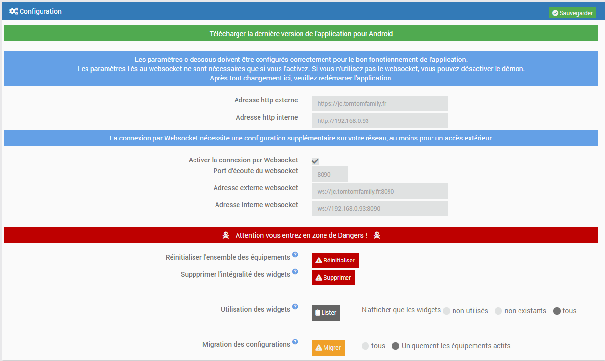  

L'option `Migration des configurations` va vous aider à réaliser cette mise à jour.  

- sélectionnez le choix `uniquement les équipements actifs`  
- cliquez sur le bouton `Migrer`  
Un message de confirmation vous indique que tout s'est bien passé !  
Vous pouvez retourner sur votre page principale du plugin JeedomConnect et vous devriez voir quelques changements : l'ensemble de vos widgets sont maintenant disponibles directement sur cette page.  
- vous pouvez maintenant ouvrir la configuration de votre appareil, faire un `export` de la configuration, puis sur chacun de vos autres équipements `importer` cette configuration, puis réactiver vos équipements.

 

 

## J'ai l'erreur suivante "Cette application requiert une version plus récente du plugin" 

Pour fonctionner, il faut que le plugin installé sur Jeedom et l'application (APK) que vous avez téléchargés et utilisés soient alignés.  

| Version Plugin | Version Application | Fonctionnement |
|----------------|----------------|----------------|
| Stable         | Stable         |                    |
| Stable         | Beta           |                |
| Beta           | Beta           |                |
| Beta           | Stable         |                |

La version du plugin est disponible sur la page de `configuration` du plugin :  
  
 
La version de l'application est disponible sur la page de connexion :  
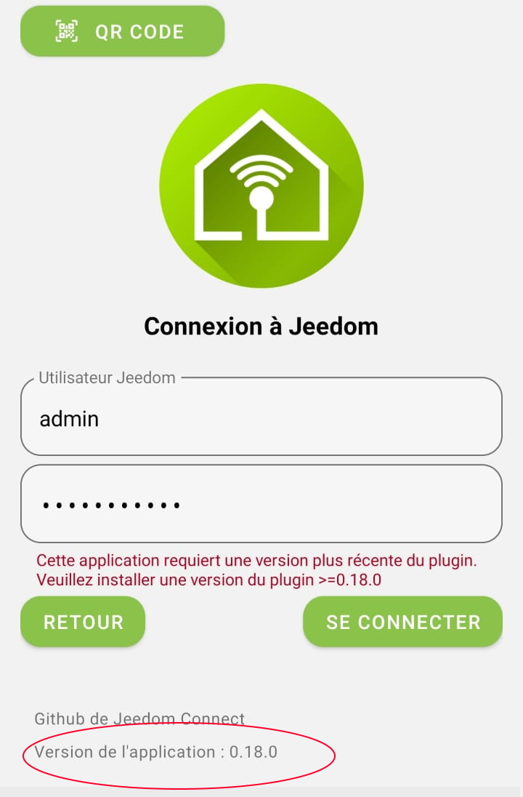  
ainsi qu'en bas de la page `Préférences` (dans la menu de l'application) :  
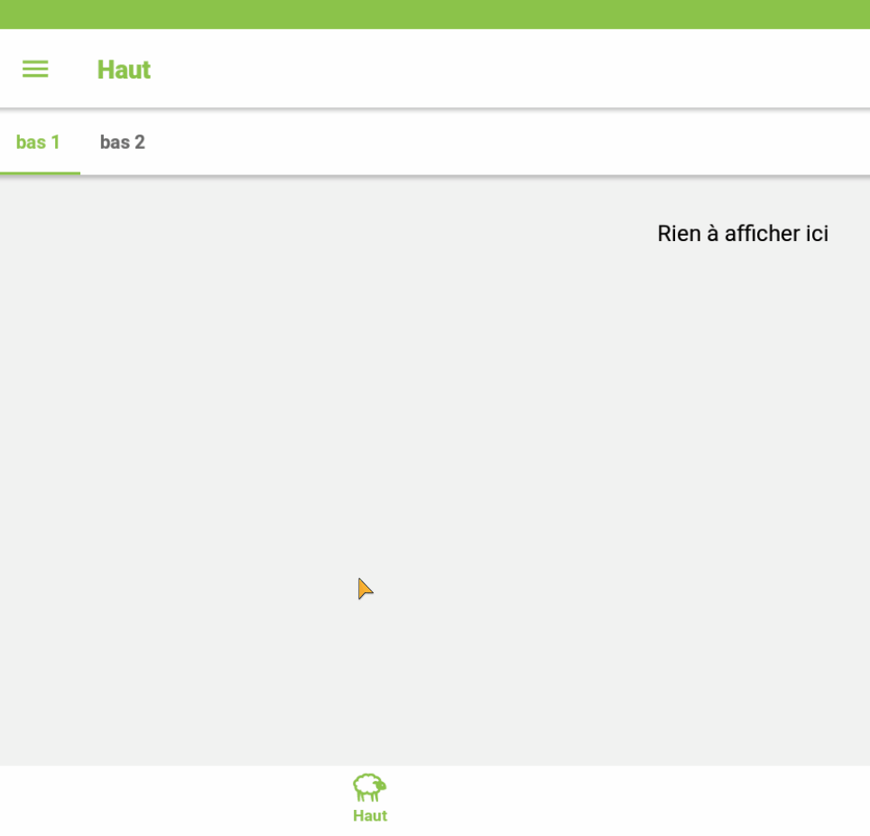  

 

## Je suis bêta-testeur, que dois-je faire ?
  
Comme son nom l'indique, la version bêta n'est pas une version stable. En l'utilisant, vous savez et acceptez que celle-ci puisse comporter des anomalies, remonter des états incohérents, réaliser (ou pas) des actions, etc ...
  
Afin d'utiliser le plugin en version bêta, il est nécessaire d'avoir l'application correspondante. Celle-ci est également disponible sur le Store, mais pour y accéder vous devez au préalable être enregistré en tant que bêta-testeur auprès du Store.  
Cette inscription est à <a href="https://play.google.com/apps/testing/com.jeedomconnect.app" target="_blank">faire ici pour Android</a> et <a href="https://testflight.apple.com/join/luZsKILI" target="_blank">ici pour Apple</a> (besoin d'avoir l'application <a href='https://apps.apple.com/fr/app/testflight/id899247664'>TestFlight</a> pour ce dernier!)

 

## Je ne vois pas la batterie d'un de mes équipements sur JC, pourquoi ?   

Seules les batteries disponibles sur la page `index.php?v=d&p=eqAnalyse` de votre jeedom sont remontées dans JeedomConnect.  
Si votre batterie n'apparait pas sur cette page, alors elle n'apparaitra pas sur JeedomConnect !  

Comment l'ajouter ? Rapprochez-vous du développeur du plugin utilisé par votre équipement afin qu'il fasse en sorte que la batterie soit visible sur la page indiquée plus haut ;)

 

## Comment « vider le cache » ou « supprimer les données » ?   

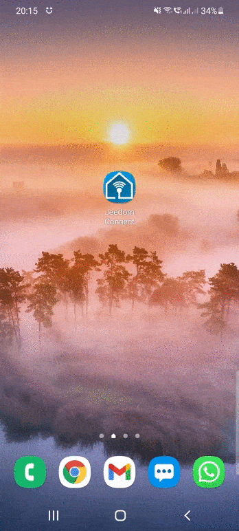  

1. Appui long sur l’icone 'JeedomConnect' (sur votre bureau ou dans la liste de toutes vos applications disponibles)
2. Clic sur le petit `i`
3. Sélection 'Stockage'
4. Au choix (en fonction de ce que vous avez à faire!) : 'Vider le cache' et/ou 'Supprimer les données'

 

## Quelles différences entre l'édition et la personnalisation d'un widget ?   

- Editer un widget :
  - permet de modifier la configuration d’un widget.
  - ces modifications impactent l’ENSEMBLE des équipements.
  - ces modifications sont directement visibles depuis la page principale côté plugin

>  
> exemple : je modifie la commande « ON » de ma lumière, tous mes équipements (mes téléphones) sont mis à jour avec cette nouvelle commande  
>  

- Personnaliser un widget :
  - permet de personnaliser la configuration d’un widget sur UN équipement
  - ces changements ne sont pas visibles côté plugin
  - ces changements n’impactent pas tous les équipements, mais seulement celui sur lequel on fait le changement
  - ces changements surchargent et sont prioritaires par rapport à la définition standard du widget

>  
> exemple : par défaut mon widget fenetre est configuré pour avoir une fenêtre fermée bleu. ma femme prefère le jaune (ca lui rappelle le soleil des vacances), sur son équipement je vais donc personnaliser le widget fenêtre pour modifier l’icone de fenetre fermée avec la couleur jaune. Cette fenêtre jaune sera uniquement appliquée sur son équipement à elle.  
>  

 

## Lors de ma première utilisation une pop-up me demande de "Sélectionner une application de l'écran d'accueil", que dois-je faire ?   

Cette option est principalement utilisée pour les appareils qui ne serviront qu'à faire de la domotique (par exemple une tablette murale pour gérer votre domotique). Le launcher ou 'application de l'écran d'accueil' permet de définir JeedomConnect comme votre nouveau bureau.  
Vous n'aurez donc plus accès à la page d'accueil de votre terminal tel que vous la connaissez avec toutes vos applications, mais votre page principale sera dorénavant JeedomConnect

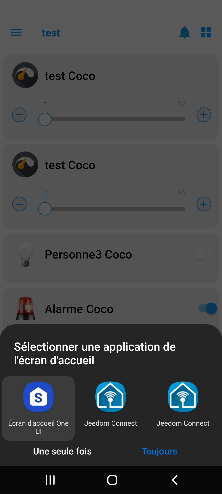  

 

## Mon téléphone reste "bloqué" sur JeedomConnect. Comment retirer le mode launcher ?   

Si vous souhaitez retirer le mode launcher de votre téléphone, il vous suffit d'aller dans le menu "Application d'accueil"  (le chemin peut différer selon votre modèle du téléphone)  
`Paramètres du téléphone (par la barre du haut/roue crantée) / Applications / Applications par défaut / Application d’accueil`

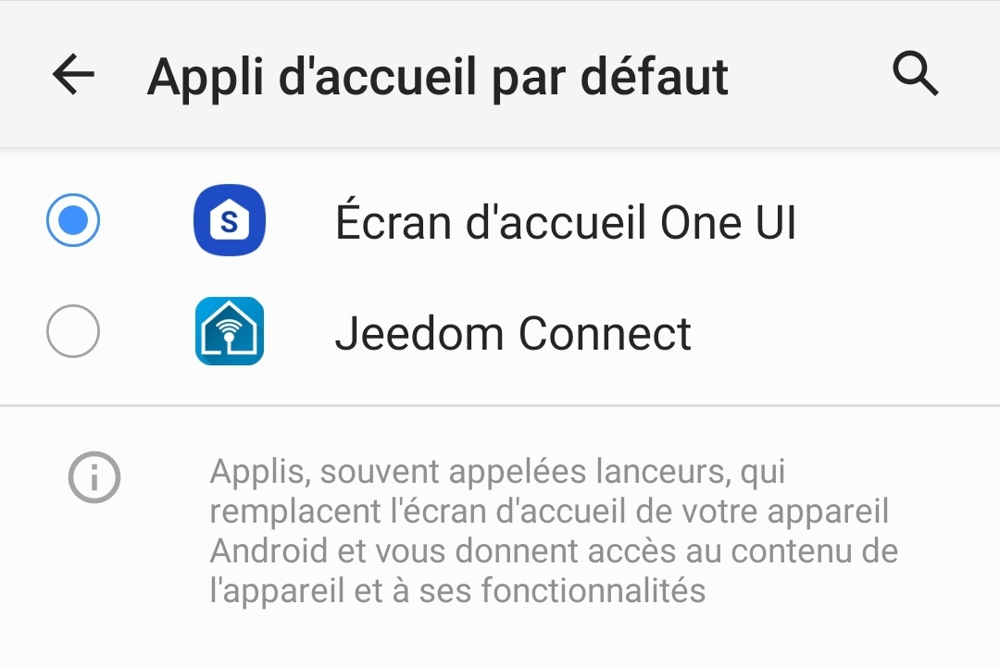  

 

## Comment configurer le widget Caméra ?   

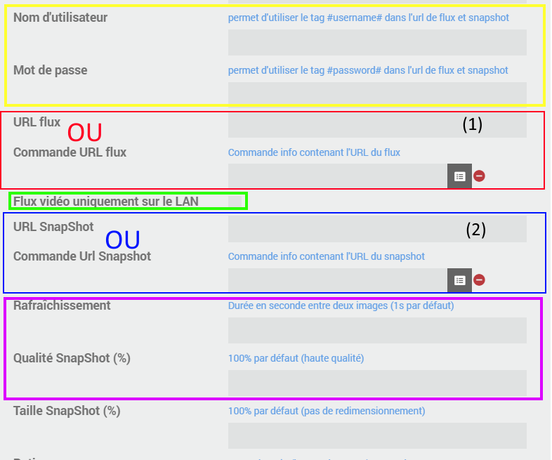  

en jaune :  
ce sont des données qui sont utilisées pour remplacer des informations saisies sur les champs `url de flux` et `url de snapshot` (champs 1 et/ou champs 2)  

en rouge : les informations pour récupérer un flux vidéo.  
il faut uniquement remplir l’un des deux champs :  
soit indiquer directement l’url à utiliser pour avoir la vidéo  
OU  
soit indiquer la commande qui renverra l’url à utiliser pour voir la vidéo  
*Si vous souhaitez accèder au flux vidéo depuis l'extérieur, une possibilité est de faire des redirections de port pour rendre le flux rtsp accessible depuis l'extérieur (à vos risques et périls donc :) [un exemple ici](https://community.jeedom.com/t/camera-ezviz-c6n-url-snapshot/63957/2) )*

en vert :  
si la configuration mise pour la vidéo (en rouge!) est accessible depuis l’extérieur : à décocher  
si la configuration n’est accessible que sur le réseau local : à cocher  

en bleu : les informations pour prendre une photo.  
il faut uniquement remplir l’un des deux champs :  
soit indiquer directement l’url à utiliser pour prendre une photo  
OU  
soit indiquer la commande qui renverra l’url à utiliser pour prendre la photo  

en rose :  
permet de réduire le nombre de photos reçues ainsi que la qualité  

  
un exemple
  

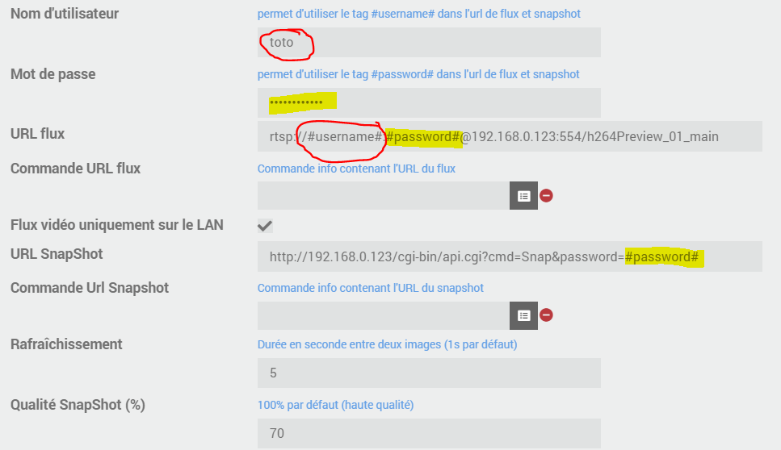  
   
url de flux : j’ai indiqué une IP locale => la caméra n’est pas visible depuis l’extérieur de mon domicile  
DONC je coche la case LAN    

l’utilisateur et le mot de passe seront automatiquement remplacés dans les url de flux et de snapshot    

quand je suis en wifi => je vois la vidéo en direct   
quand je suis en 4G => je reçois une photo toutes les 5 sec, avec une qualité de 70% 

 

## J'ai un message "A lire" qui n'arrête pas de s'afficher. Comment le masquer définitivement ?   

 
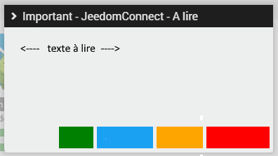  

rassurez-vous, il n’y a AUCUN bug sur cette fenêtre, si elle réapparait systématiquement c'est que vous faites mal quelque chose :)  

Devant le nombre de fois où nous sommes obligés de (re)demander d’avoir les infos sur votre installation, j’ai mis en place une petite fenêtre d’information « A lire » qui s’affichera lorsque vous irez sur la page principale du plugin :  

Pour infos :  

- les 4 boutons sur le bas ne sont initialement pas présents, et s’afficheront 10 sec après que la fenêtre ait été affichée (pile poil le temps de vous laisser lire !)
- si vous cliquez en dehors de la fenêtre pour la fermer ou cliquez sur un « mauvais » bouton => le message se réaffichera dans la journée, à l’infini...  
- si vous lisez correctement & entièrement l’info et que vous appuyez sur le bon bouton, la fenêtre n’apparaitra plus dans la journée. Par contre ... 2 nouveaux « rappels » suivront sur les 2 jours suivants, juste pour être sûr que c’était pas un coup de chance et que vous avez bien lu :) :)

--> du coup le 1er qui me dit qu’il n’avait pas vu l’info, devra ma payer un cocktail ! :D

le process peut-être un peu chiant, j’en suis désolé, mais pas plus enquiquinant que moi qui suit sans cesse obligé de demander les infos 1 sujet sur 2 !
après tout… il n’y a pas de raison qu’il n’y ait que moi qui ait la partie chiante :D :D :D  

bonne lecture, et attention à vos clics !  

 

## Les cartes de geofence et de localisation sont centrées sur Paris par défaut, comment changer ?   

Les différentes cartes se centrent sur la position définie sur la page configuration du plugin JC.  
Si ces informations ne sont pas renseignées, nous prenons alors les coordonnées de votre Jeedom (`Réglages / Systèmes / Configuration / Coordonnées`). Dans le cas où ces dernières ne sont pas indiquées, alors par défaut nous centrons sur Paris.

 

## Comment formater une date/heure dans les widgets ?   

Direction quelques exemples donnés [ici](#momentjs)

 

## J'ai un message "Address already in use" au démarrage du démon, comment faire ?   

Il y a deux options :

1. La plus simple : redémarrez votre Jeedom
2. La plus risquée : killez le processus qui utilise déjà ce port (il y a de forte chance que ce soit la précédent démon de JC qui ait mal été stoppé, mais il se peut que ce soit autre chose ... )  
Allez dans `Réglages > Système > Configuration > OS/DB > Administration Système`  
sur la nouvelle page qui s'affiche :
  a. tapez la commande suivante `sudo netstat -tulpn | grep LISTEN | grep 8090` (si vous avez gardé le port `8090` par défaut, sinon changez le)  
  b. validez avec `OK`  
  c. trouvez la ligne qui correspond au port que vous recherchez  
  d. notez le numéro de processus qui tourne --> ici le `7476`  
Ensuite dans la barre (a) changer la commande et tappez `sudo kill -9 7476` (évidemment remplacez `7476` par le nombre que vous avez trouvé en (d))  
Vous pouvez retourner sur la page configuration de JC pour redémarrer le démon

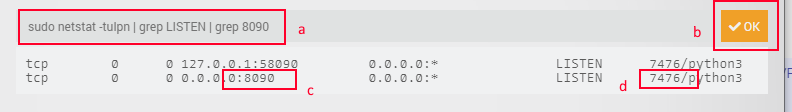  

 

## Je trouve l'application géniale ! Comment vous aider ?   

En partageant vos idées d'améliorations, vos suggestions et vos retours sur des bugs !
Puisque ça a été demandé plusieurs fois, si vous souhaitez soutenir "financièrement" parlant, nous vous proposons de payer un café (ou deux, ou mille ! :) ) :  

 

## Je ne trouve pas de réponse à mon probleme dans la doc. Que faire ?   

Suivez les indications postées dans [ce message](https://community.jeedom.com/t/plugin-jeedomconnect-actualites/71794/2) afin de créer un nouveau sujet sur le forum.
