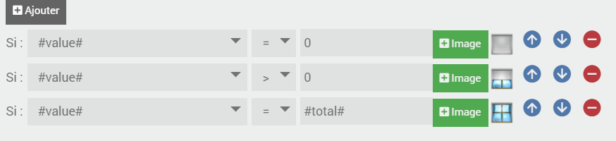
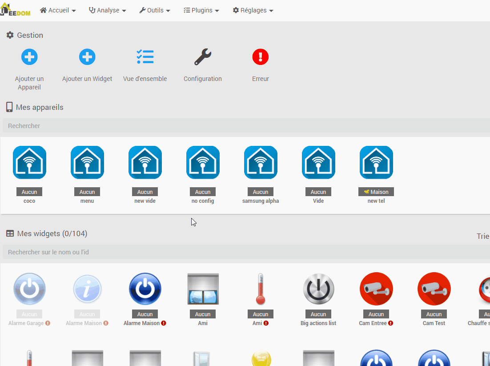

# Documentation du plugin Jeedom Connect

<a href="https://play.google.com/store/apps/details?id=com.jeedomconnect.app" target="_blank">Télécharger l'application directement depuis le Store !</a>   
si vous êtes bêta-testeur et utilisez la version bêta du plugin, [regardez-ici](#qBeta)  

Pour accéder à la TODO list [c'est par là!](todo.md)  

1. [Présentation du projet](#presentation)
2. [Fonctionnalités](#fonctionalites)
3. [Screenshots](#screenshots)
4. [Installation du plugin](#install)
5. [Configuration du plugin](#configurePlugin)
6. [Gestion des Widgets](#gestionWidget)
7. [Ajouter des équipements](#addEq)
8. [Configuration d'un équipement](#configureEq)
9. [Commandes disponibles sur un équipement](#eqCmd)
10. [Géolocalisation](#geoloc)
11. [Notification](#notification)
12. [Matching entre les versions Application (APK) <=> Plugin](#version)
13. [FAQ](#faq)

## Présentation du projet 
Le projet **Jeedom Connect** se compose de 2 parties : un plugin pour Jeedom, et une application Android. Une version pour iOS pourra être envisagée plus tard.

L'application utilise la plupart des éléments de navigation d'une application : un drawer (menu dépliable sur la gauche), un menu bas, un menu haut, et des listes accordéon. Tous ceux-ci sont personalisables à partir du plugin.

La brique de base est la notion de *widget*, qui va représenter un "équipement domotique" (une alarme, une lumière, une info température...). Contrairement à l'application mobile officielle, Jeedom Connect n'ira pas chercher vos équipements / commandes pour vous les afficher directement. C'est à vous de définir un à un vos widgets. Ceci permet une flexibilité au niveau du rendu final.

Le plugin, ainsi que l'application sont complètement **gratuit** et le resteront. Je ne suis pas développeur et fais ça sur mon temps libre, relativement limité. 
Si vous souhaitez **soutenir le projet**, vous pouvez suggérer des améliorations, signaler des bugs et contribuer au code du plugin si vous avez des notions de PHP/JS/HTML, ou de l'application si vous maîtriser le React Native.  
Pour celles et ceux qui tienent vraiment à soutenir financièrement parlant le projet :  
  

[plus d'infos](#qDon)

  

## Fonctionnalités 
- Affichage et gestion de vos équipements domotiques et des scénarios
- Affichage et gestion des caméras
- Historiques sous forme de graphique ou tableau
- Possibilité de sécuriser toutes les actions avec données biométriques
- Personalisation poussée de l'interface
- Notifications Push enrichies compatibles avec Ask
- [Géolocalisation](#geoloc) avec gestion avancée de la batterie (modes Geofencing et Tracking)
- Communication via le protocole WebSocket à faible latence, ou bien en HTTP
- Thème personalisable (couleur, mode sombre)

    

## Screenshots 

    

## Installation du plugin 
Il s'installe depuis le market comme les autres.  

La version beta contient les nouveautés les plus récentes. (A noter que cette version peut contenir des bugs et reste à privilégier pour des utilisateurs expérimentés).

    

## Configuration du plugin 
### Configurer l'accès à votre jeedom :  										   
Il y a plusieurs champs  pré-remplis que vous pouvez modifier. Des placeholder sont indiqués sur chacun d'entre eux. S'ils vous semblent corrects, inutile de les modifier.
* **Adresse http externe** : Indiquez ici votre adresse d'accès à Jeedom depuis l'extérieur de votre domicile.
* **Adresse http interne** : Adresse de Jeedom sur votre réseau local.
* **Activer la connexion par Websocket** : Indiquera à l'application si vous préférez utiliser le protocole Websocket pour la communication avec vos appareils. Notez tout de même que l'adresse HTTP est nécessaire au bon fonctionement de certains services (images persos, géolocalisation, actions sur notifications)  						
* **Port d'écoute du websocket** : Sauf si vous avez une application qui utilise ce port, vous n'avez pas besoin de le modifier. En cas de modification, n'oubliez pas de redémarrer le démon.
* **Adresse externe websocket** : Adresse websocket accessible depuis l'extérieur (nécessite une configuration de votre réseau)
* **Adresse interne websocket** : Adresse websocket sur votre réseau local

Si vous modifiez un de ces champs, il faudra bien sûr sauvegarder, puis re-générer les QR Code des équipements. En cas d'utilisation du HTTP, il faudra aussi redémarrer l'appli.
 

### Personnaliser le plugin

Vous avez la possibilité de personnaliser le chemin d'accès à vos images/icônes.  
Par défaut, les images personnalisées du plugin sont stockées sous `plugins/JeedomConnect/data/img/user_files/`.  
  
Vous pouvez choisir d'utiliser un autre emplacement en renseignant le champ `Chemin pour les images perso` le chemin d'accès au répertoire qui contient vos images et icônes personnels.  
:warning: Le chemin ne dois PAS contenir la racine 

> par exemple, si vous souhaitez utiliser le répertoire `/var/www/html/data/img/` alors indiquez : `data/img/` dans le champ  (attention au derni `/`!)

 

### la Zone des Dangers

Les actions disponibles dans cette partie sont à utiliser avec précaution. Vous pouvez en effet perdre l'intégalité de vos configurations si vous ne faites pas attention à ce que vous faites.  

* **Réinitialiser** : efface les configurations de l'ensemble de vos équipements. Vous devrez donc redéfinir quels sont les widgets que vous souhaitez avoir sur chacun de vos équipements  
* **Supprimer** : remet à 0 l'intégralité du plugin. Vous perdrez TOUTES vos configurations et l'ensemble de vos widgets seront supprimés. (comme si vous installiez le plugin pour la première fois)  
* **Lister** : permet d'obtenir la liste des widgets (id) :
  + non-utilisés : existant mais rattaché à aucun équipement
  + non-existants : présent dans le fichie de configuration d'un équipement, mais non créé sur le plugin (mauvaise migration par exemple)
  + tous : liste le nombre de fois où un wigdet est utilisé (format => "widget ID" : "nombre d'utilisation")  
* **Exporter**/**Importer** : permet d'extraire l'ensemble de la configuration des widgets, et les réimporter sur une autre instance jeedom  
* **Migrer** : transforme les fichiers de configuration dans le nouveau format attendu du plugin		

    

## Page principale du plugin JeedomConnect   

La page principale du plugin se décompose en deux parties :     
1. Sur la partie haute, vous pourrez voir et gérer [vos équipements](#addEq) (appareil muni de l'application JeedomConnect)
2. Sur la seconde partie : vous aurez accès à l'ensemble de [vos widgets](#gestionWidget) et pourrez les modifier à souhait.

    

## Gestion des widgets 

Il est nécessaire de commencer par créer un widget pour ensuite pouvoir le rattacher à un (ou plusieurs) équipement(s).  
Sur la page principale vous avez accès à l'ensemble des widgets que vous avez créé. Il est possible de les filtrer par type et de les classer (par Pièces, Nom, ou Type).  

Pour créer un widget, cliquez sur "Ajouter un widget", sélectionnez ensuite le type de widget que vous souhaitez créer dans la liste déroulante de gauche puis renseignez les différents champs affichés à l'écran avant de finaliser la création en appuyant sur le bouton "Sauvegarder".  

Quelques éléments sont standard et seront demandés pour l'ensemble des widgets :  
   * **Actif** : Le widget sera (ou pas) affiché dans l'application. Pratique si vous voulez par exemple gérer un groupe de lumières, mais ne pas afficher certaines d'entre elles.
   * **Pièce** : Sélection de la pièce associée (identique aux objets gérés dans Jeedom)
   * **Nom** : Nom du widget
   * **Sous-titre** Information complémentaire affichée dans l'application. Le mode personalisé permet de mettre une phrase quelconque, avec certains "mots-clé", généralement `room`, `value`, `formatedValue`, `elapsedTime`, `power`.   
   Par exemple :  
   `Mon ampoule est formatedValue depuis elapsedTime et consomme power W`  
   donnera :  
   `Mon ampoule est allumée depuis 1h12min et consomme 15W`  
   * **Affichage forcé** : De façon standard, chaque widget (sauf exception) possède 3 types d'affichage : carte, vignette et détail. Les affichages carte et vignettes peuvent être choisis via l'icône en haut à droite dans l'application. L'affichage détail est une page entière affichée quand on click sur le widget. Vous pouvez ici forcer un widget à s'afficher d'une de ces 3 façons.  
   Attention pour le mode détail, le widget doit être seul sur sa page.
   * **Sécuriser les actions** : Toutes les commandes de type action peuvent être sécurisées à l'aide de ces trois boutons :  
        
   Le premier permet de faire une simple demande de confirmation de l'action.  
   Le second demande une donnée biométrique (empreinte digitale, reconaissance faciale) pour exécuter l'action (sur appareils disposant d'un capteur).
   Le dernier demandera le mot de passe configuré dans les paramètres de l'équipement.
   * **Images** : Les images de l'application sont stockée dans le dossier `plugins/JeedomConnect/data/img/`. Si vous souhaitez ajoutez des images persos, utilisez l'assistant, ou bien copiez vos images dans `plugins/JeedomConnect/data/img/user_files/`. Il est conseillé d'utiliser des images PNG en 128x128. Vous pouvez aussi mettre des GIF animés.
   * **Images sous conditions** : Vous pouvez dans certains widgets définir une image en fonction des valeurs d'une commande. L'ordre des ces condition sera prise en compte par l'appli (les plus hautes sont prioritaires).  
   * **Ajouter des infos** : vous permet d'ajouter des commandes de type `info` de votre Jeedom et de vous en servir pour les autres champs du formulaire 'Images sous conditions', 'Nom', 'Sous-titre'.

La duplication d'un widget est réalisable dès que celui-ci a été sauvegardé une première fois. Cliquez simplement sur le bouton "Dupliquer", réaliser vos modifications (ou pas), et enregistrer (impérativement) en validant avec le bouton "Sauvegarder".  

La suppression est également possible. Attention toutefois, si un widget est supprimé, alors il disparaitra de l'ensemble des équipements auxquels il avait été ajouté !  

* ### Widgets disponibles  

|  |  |  |
|------|-----|-----|
|Alarme|Caméra|Climatiseur|
|Favoris|Fenêtre|Générique actions|
|Générique binaire|Générique message|Générique numérique|
|Générique slider|Générique switch|Générique texte|
|Géolocalisation|Groupe d'alarmes|Groupe de fenêtres|
|Groupe de génériques binaires|Groupe de lumières|Groupe de PIR|
|Groupe de portes|Groupe de prises|Groupe de volets|
|Humidité|Liste de choix|Lumière à variation|
|Lumière de couleurs|Lumière On/Off|Luminosité|
|Mode|PIR|Portail coulissant|
|Porte|Prise|Puissance|
|Résumé|Résumé de pièce|Scénario|
|Température|Thermostat|Volet|
|Web View|||

    

## Ajouter des équipements 
Vous pouvez ajouter des équipements dans le plugin de façon standard.

1 équipement = 1 appareil muni de l'application

A la création d'un équipement, une clé API, ainsi qu'un QR Code est automatiquement généré avec les informations de configuration du plugin. Lors du démarrage de l'application, vous pourrez alors entrer manuellement vos identifiants jeedom, ou bien scanner le QR Code. Une fois connecté, l'équipement et l'appareil sont liés. Pour vous connecter avec un autre appareil, il vous faut le *détacher*  en cliquant sur le bouton associé.

La configuration d'un équipement consiste en un fichier JSON configurable avec l'assistant, et que vous pouvez exporter / importer. Si vous voulez par exemple cloner un équipement, ajoutez en un nouveau et utiliser l'exportation / importation.  

Le dernier bouton permet lui de transmettre votre fichier de configuration complet, en cas de problème, au développeur. Ce fichier ne DOIT PAS être importer sur un autre équipement JeedomConnect.  

    

## Configuration d'un équipement 
La configuration du contenu de l'application se passe dans l'assistant.

Le changement de configuration a lieu à chaque click sur le bouton *Sauvegarder*. Si l'application est démarrée, elle est automatiquement transférée (websocket uniquement). Vous pouvez recharger la configuration dans l'appli en appuyant sur le logo du 'menu hamburger'.  
Si vous pensez avoir une erreur avant d'avoir sauvegarder (par exemple supprimé un élément par erreur), actualisez simplement la page. Le bouton *Réinitialiser* (suivi de *Sauvegarder*) remet toute la configuration à zéro, attention donc !

   

* ### Menu du bas

Cette partie est assez explicite, elle permet de configurer les onglets qui apparaissent en bas de l'écran. Vous avez la possibilité de choisir vos icônes parmis tout un panel : celles de Jeedom, celles proposées par Material Design, ou encore sur Font Awesome(un moteur de recherche est intégré).  
La configuration de cette partie est optionnelle, et n'est à réaliser que si vous souhaitez utiliser ces onglets.

    

* ### Menu du haut
 

 Cette partie est également explicite. Un menu sous forme d'onglets en haut de l'écran que vous pouvez 'slider'. Egalement facultatif.

    

* ### Pièces
 Chaque widget peut être associé à une pièce à ajouter dans cette partie.  Chaque pièce correspond à un objet Jeedom.  

    

* ### Résumés
 Vous avez la possibilité de choisir les résumés Jeedom que vous souhaitez rappatrier sur l'application JeedomConnect.  
 Depuis l'onglet 'Résumé', vous pourrez : 
 * Ajouter un résumé, après l'avoir sélectionné dans la liste déroulante  
 * Importer l'ensemble des résumés existants (le bouton est caché si vous avez déjà tous les résumés dans l'application)
 
  

Il vous est ensuite possible de cliquer sur chaque résumé pour personnaliser les icônes et leurs conditions d'affichage.  
  

Deux variables sont disponibles : `#value#` et `#total#` :  
- `#value#` correspond à la donnée du résumé remontée par Jeedom (nombre de volets ouvertes par exemple)
- `#total#` correspond au nombre total de commandes rattachées à ce résumé (nombre de volets total sur le résumé par exemple)

    

* ### Widgets
 
 Définissez d'abord l'emplacement où placer le widget : sur quel menu / sous-menu que vous voulez le configurer.   
 Vous pouvez ensuite filtrer sur le type de widget que vous allez ajouter (ne sont proposés que les types de widget déjà créés).  
 Sélectionnez le widget que vous souhaitez ajouter, puis enfin cliquez sur le **Ajouter ce widget** pour l'ajouter à votre configuration.  
 * **Ajouter un groupe** : Vous pouvez ranger vos widgets dans un menu dépliable (type "acordéon").  
   * **Actif** : Le groupe sera (ne sera pas) affiché dans l'application.
   * **Développé par défaut** : Le comportement par défaut (plié / déplié) du menu.  
  

 Différentes actions sur possible sur chaque élément :  
   
 * les flèches bleues permettent de monter ou descendre le widget par rapport aux autre widgets sur la même page. Elles permettent aussi de faire entrer ou sortir un widget dans un groupe  
 * le moins rouge permet d'enlever le widget de la page (ça ne supprime pas le widget dans Jeedom)
 * la flèche verte (vers la droite) permet de déplacer le widget sur une autre page  

    

## Commandes disponibles sur un équipement 
Par défaut les commandes suivantes sont disponibles dans chaque équipement :
- `Position` : Lorsque la géolocation est activée, donne les coordonnées GPS de l'appareil sous la forme `latitude,longitude`. Il est aussi possible d'ajouter l'altitude, l'activité et la batterie en cochant la case correspondante dans les paramètres de l'équipement.
- `Activité` : Lorsque la géolocalisation est activée, donne l'activité en cours sur l'appareil. LValeurs possibles : ``still``, ``on_foot``, ``running``, ``on_bicycle`` et ``in_vehicle``
- `Notification` : Commande de notification par défaut
- `Afficher page` : Lorsque l'application est en premier plan, permet de basculer sur une page donnée. Il s'agit d'une commande action message. Pour l'utiliser, commencer par repérer l'`id` de la page. Cell-ci est disponible en survolant votre souris sur les menus de l'assistant de configuration. Indiquez alors cet `id` dans le champs `titre` ou `message` de la commande.
- `Lancer App` : Lorsque l'application est en premier plan, permet de lancer sur votre appareil une application. Il s'agit d'une commande action message qui accepte dans son champs `titre` ou `message` le nom du package de l'application.
- `Détacher` : Permet de détacher l'appareil de l'équipement.

  

## Géolocalisation 
Jeedom Connect dispose d'une fonction de Geofencing : définissez des lieux géographiques sur une carte et des commandes binaires seront créées dans votre équipement vous indiquant si l'appareil est dans ce lieu ou pas.

Commencez par ouvrir l'application et rendez-vous dans les Préférences puis activez la géolocalisation.  

Pour le bon fonctionnement du service, il est impératif d'accepter toutes les autorisations, en particulier la `Localisation` doit être sur `Toujours autoriser` (Android 10+)

Vous pouvez ensuite aller sur `Gestion des lieux`.
- Pour **définir une zone**, faites un appuie long sur la carte puis donner un nom et un rayon (en mètres). Le binaire est immédiatement créé côté Jeedom.
- Pour **supprimer ou éditer une zone**, appuyez sur le marqueur puis sur le nom qui apparait.
- Pour **déplacer une zone**, faites un appuie long sur le marqueur puis glisser.
Jeedom Connect possède aussi une fonction de Tracking qui vous permet de connaitre à tout moment la position de votre appareil. Les coordonnées GPS (latitude,longitude) sont accessibles dans la commande `Position` de votre équipement.

    

# Notification 

Vous avez la possibilité de gérer différents types de notifications sur l'application Jeedom Connect. Ces notifications peuvent être utilisées comme vous le feriez déjà avec l'envoie par Jeedom d'un SMS, Telegram, et autres sortes de messagerie.  
Vous pouvez donc vous envoyer des notifications (via des scénarios par exemple) : lorsque votre porte d'entrée s'ouvre alors que vous êtes absents, pour vous prévenir de sortir la poubelle, indiquer que le facteur est passé, ... vers votre application JeedomConnect.

## Les Canaux  

Dans le paramétrage des notifications, vous avez la possibilité de créer plusieurs canaux.  
Ces canaux permettent de définir différentes façon de réagir qu'aura votre smartphone à la réception d'une notification JeedomConnect.  

<u>Par exemple</u> depuis le plugin, vous pourriez créer un canal `Défaut`, un `Silence` et enfin un `Urgent` (propre à chaque équipement).
Ces canaux sont ensuite disponibles sur votre application mobile JeedomConnect. Faites un clic long sur l'icone JeedomConnect, puis 'informations', ensuite allez dans le menu 'notification' : vous devez alors voir les 3 canaux précédemment créés `Défaut`, `Silence` et `Urgent`.  

Vous pouvez alors les personnaliser : (toujours <u>en exemple</u>)
  - le canal `Silence` recevra toutes les notifications pour lesquels je ne souhaite pas être dérangé : donc je choisis de ne pas avoir de son
  - la canal `Urgent` par contre il faut absolument que je lise les notifications au plus vite, du coup je choisis une sonnerie bien particulière (je peux augmenter également le son), et je choisis l'option 'Ignorer ne pas déranger'

  

## Les notifications

Il faut ensuite créer les commandes notifications qui auront un lien avec nos canaux.
Dans l'onglet `notification`, (toujours en partant de <u>l'exemple</u> donnée au dessus), je crée donc 3 notifications : `notification` (créé automatiquement) en lien avec le canal `Défaut`, `notif silencieuse` que je lie au canal `Silence`, et `notif urgente` que je rattache au canal `Urgent`.  
Vous pouvez également :  
- mettre à jour l'existante : si cochée, alors vous ne verrez qu'une seule notification du même type dans votre barre de notification sur votre smartphone. (si décochée, chaque notification sera affichée)
- couleur : définit la couleur du titre de la notification sur votre smarphone, ainsi que celle de la notification
- image : permet d'ajouter une image sur le coin en haut à droite de la notification
- actions : permet de réaliser commandes et/ou scénario à chaque fois qu'une notification est envoyée. (<u>par exemple</u> : si envoie d'une notification urgente, je veux avoir la possibilité d'executer le scénario qui permet de déclencher l'alarme de la maison)

  
 
   
### Comment envoyer une notification ?

Une fois que vous avez paramétré vos différentes notifications, les commandes associées sont automatiquement créées sur votre équipement (après `sauvegarde`), dans l'onglet dédié comme sur tout équipement Jeedom :  
  

vous pouvez donc vous en servir dans un scénario ou n'importe quelle autre type (interraction, bloc code, ...) :   
  

Voici par exemple la réception d'une notification : (avec les configurations présentées précédemment, ça reste donc toujours qu'un exemple possibe ! )   

  

C'est une `notif Urgente` qui a été envoyée, donc puisque la notification est paramétré sur le canal `Urgent`, mon téléphone sonne donc avec un fort volume même si je suis en mode 'ne pas déranger'.  
La notification est affichée en rouge dans la barre de notification Android, ainsi que lorsque je la visualise en entière dans l'application JeedomConnect, et on voit la présence d'une icône 'sirène rouge' dans le coin supérieur droit.    
Et j'ai également la possibilité de cliquer sur le bouton `Alarme maison` pour exécuter le scénario que j'ai paramétré et qui déclenchera l'alarme de ma maison.

 
    
### Comment envoyer une notification à tous les appareils ? 

Par défaut l'envoie d'envoyer à "tous" les appareils JC n'existe pas. En effet, il est possible de configurer plusieurs types de notification par appareil, il nous est donc impossible de deviner laquelle est à utiliser.  
Avant d'utiliser la commande `Notifier les appareils JC`, il faut : 
- aller sur les équipements que vous souhaitez notifier
- entrer dans l'assistant des notifications, puis onglet `Notification`
- choisir la notification qui devra être prise en compte par cette commande
- cocher la case `Notifier tous les appareils JC` 
- sauvegarder cette fenêtre `Configuration des notifications`
- sauvegarder ensuite votre page principale de l'équipement concerné  

  

NB : la commande `Notifier les appareils JC` est disponible sur l'ensemble des vos équipements JC, y compris ceux pour lesquels vous n'auriez pas coché la case `Notifier tous les appareils JC` !   
Vous pouvez donc utiliser cette commande depuis n'importe quel équipement.  

### Utilisation avec Ask

Les notifications Jeedom Connect sont compatibles avec la fonction Ask de Jeedom. Vous pouvez indiquer autant de réponses souhaitées, ou bien attendre une réponse tapée en texte libre directement dans la notification. Il est également possible de définir un timeout au delà duquel il n'est plus possible de répondre.

## Envoyer des images

Il est possible d'envoyer des images aux notifications (par exemple des shot de caméras). La première images sera visible dans la notification Android directement. Pour accéder aux autres il faut se rendre dans la page de notification de l'application.

    

# Matching version Application (APK) <=> version Plugin sur Jeedom 

:warning: Ces informations sont obsolètes depuis la version 0.18.2.  
Dorénavant, les applications sont disponibles au téléchargement directement et uniquement depuis le Store.  

  
Ancienne version/méthode

  L'apk est téléchargeable en cliquant sur le numéro de version.

  ## Version Stable

  |Version plugin |Version Application  |
  |------|-----|
  |0.17.1 (15/03/2021 11:14:23)|[0.17.1](https://github.com/jared-94/JeedomConnectDoc/raw/master/resources/apk/stable/JeedomConnect-0.17.1.apk) |
  |0.16.0 (22/02/2021)|[0.16.0](https://github.com/jared-94/JeedomConnect/releases/download/0.16.0/JeedomConnect-0.16.0.apk) |

     

  ## Version Beta

  |Version plugin |Version Application  |
  |------|-----|
  |0.18.1 (2021-03-17 10:23:20) | [0.18.0-beta](https://github.com/jared-94/JeedomConnectDoc/raw/master/resources/apk/beta/JeedomConnect-0.18.0-beta.apk)  |
  |0.18.0 (15/03/2021 11:27:31) | [0.18.0-beta](https://github.com/jared-94/JeedomConnectDoc/raw/master/resources/apk/beta/JeedomConnect-0.18.0-beta.apk)  |
  |0.17.1 (05/03/2021) | [0.17.1-beta](https://github.com/jared-94/JeedomConnect/releases/download/0.17.1/JeedomConnect-0.17.1-beta.apk)  |
  |0.17.0 (04/03/2021) | [0.17.0-beta](https://github.com/jared-94/JeedomConnect/releases/download/0.17.0/JeedomConnect-0.17.0.apk)  |

     

  ## Lien github générique

  https://github.com/jared-94/JeedomConnect/releases/latest

    

# FAQ 

  * [Comment télécharger l'application ?](#qOU)
  * [J'ai un Iphone, comment utiliser l'application ?](#qIphone)
  * [Quelle est la différence entre connexion HTTP et Websocket ?](#qConnexion)  
  * [L'application m'indique "Cet équipement utilise un ancien format de configuration. Veuillez effectuer la migration"](#qMigration)
  * [J'ai l'erreur suivante "Cette application requiert une version plus récente du plugin"](#qVersion)
  * [Je suis bêta-testeur, que dois-je faire ?](#qBeta)   
  * [Comment « vider le cache » ou « supprimer les données » ?](#qVideCache)
  * [Je ne vois pas la batterie d'un de mes équipements sur JC, pourquoi ?](#qBattery)
  * [Je trouve l'application géniale ! Comment vous aider ?](#qDon) 

---

## Comment télécharger l'application ?    

L'application est pour le moment uniquement disponible pour Android.  
Elle est disponible sur le Play Store de Google ainsi que sur la page de Release du Github de Jeedom Connect.

 

## J'ai un Iphone, comment utiliser l'application ?   

Pour l'instant il n'est pas possible d'utiliser l'application JeedomConnect sur Iphone.  
Le développement de l'application est bien prévu, mais non réalisé pour le moment.  
Aucune date n'est annoncée sur la sortie de celle-ci, mais dès que ce sera possible une communication sera faite sur le forum !

 

## Quelle est la différence entre connexion HTTP et Websocket ?   
Avec Jeedom Connect, il est possible d'établir la connexion entre votre appareil et le plugin de deux façon différentes :
- **Http** : Au lancement de l'application, une connexion Http de type Source Event Server est établie avec le plugin. Cette connexion est persistente mais uni-directionnele : de Jeedom **vers** votre appareil. Les actions de votre appareils vers Jeedom sont des requêtes Http uniques utilisant le protocole JSON RPC.
Ce mode de connexion ne nessécite aucune configuration particulière et est compatible avec les DNS Jeedom.
- **Websocket** : La connexion websocket est quant à elle bi-directionnelle. Elle nécessite néanmoins une configuration de votre réseau pour être utilisée en dehors de votre réseau local. Il est possible de faire une redirection de port sur votre routeur (méthode simple) ou bien de configurer votre serveur proxy ou le serveur Apache de votre Jeedom (utilisateurs avancés).

Le Websocket offre une connexion **plus stable et plus performante** que la connexion Http.

 

## L'application m'indique "Cet équipement utilise un ancien format de configuration. Veuillez effectuer la migration"   

  

La mise à jour que vous venez de réaliser nécessite une mise à jour au niveau du fichier de configuration utilisé pour définir vos widgets.  
Que va faire cette opération ? Elle va lire votre(vos) fichier(s) de configuration et créér automatiquement tous les widgets correspondant.  
:warning: si vous avez plusieurs équipements (téléphone/tablette/...) de configurer, il y a de forte chance que l'opération créé des widgets en doublon (ou plus).  
Deux choix s'offrent à vous :  
  1. migrer UN seul de vos équipement (appareil), exporter sa configuration puis l'importer sur tous vos autres équipements :  
      * le + : pas de widgets créés en doublons, pas de longue suppression manuelle à réaliser    
      * le - : si certains de vos appareils ont des widgets bien à eux, il faudra alors les recréer manuellement  
  2. migrer l'ensemble de vos équipements :  
      * le + : tous les widget seront créés automatiquement
      * le - : chaque équipement étant migré comme s'il était seul, certains widgets seront créés en doublon. Vous aurez donc besoin de faire un peu de ménage en modifiant les configurations de certains équipements puis en supprimant les widgets inutiles en doublon.   

Nous préconisons la solution #1 ! Voici comment nous vous proposons de faire :
* commencer par mettre le niveau de log en `DEBUG` sur l'application (page `configuration` du plugin, pensez à sauvegarder !)
* désactiver l'ensemble de vos équipement sous le plugin JeedomConnect, et n'en laisser qu'<b>UN SEUL actif</b> (le plus utilisé, ou celui qui contient le plus de widgets)
  

* rendez-vous sur la page `configuration` de votre plugin (Menu `Plugins/Gestion des plugins/Jeedom Connect`)  
  

L'option `Migration des configurations` va vous aider à réaliser cette mise à jour.  
* sélectionnez le choix `uniquement les équipements actifs`  
* cliquez sur le bouton `Migrer`  
Un message de confirmation vous indique que tout s'est bien passé !  
Vous pouvez retourner sur votre page principale du plugin JeedomConnect et vous devriez voir quelques changements : l'ensemble de vos widgets sont maintenant disponible directement sur cette page.  
* vous pouvez maintenant ouvrir la configuration de votre appareil, faire un `export` de la configuration, puis sur chacun de vos autres équipements `importer` cette configuration, puis réactiver vos équipements.

 

## J'ai l'erreur suivante "Cette application requiert une version plus récente du plugin"    

Pour fonctionner, il faut que le plugin installé sur Jeedom et l'application (APK) que vous avez téléchargé et utilisé soit alignés.  
Notez vos différentes versions et rendez-vous sur le [tableau de versions](#version) pour vérifier votre installation, et connaitre l'élément à mettre à jour.  

La version du plugin est disponible sur la page de `configuration` du plugin :  
  
 
La version de l'application est disponible sur la page de connexion :  
  
ainsi qu'en bas de la page `Préférences` (dans la menu de l'application) :  
  

 

## Je suis bêta-testeur, que dois-je faire ?   
  
Comme son nom l'indique, la version bêta n'est pas une version stable. En utilisant, vous savez et acceptez que celle-ci puisse comporter des anomalies, remonter des états incohérents, réaliser (ou pas) des actions, etc ...   
  
Afin d'utiliser le plugin en version bêta, il est nécessaire d'avoir l'application correspondante. Celle-ci est également disponible sur le Store, mais pour y accéder vous devez au préalable être enregistré en tant que bêta-testeur auprès du Store. Cette inscription est à <a href="https://play.google.com/apps/testing/com.jeedomconnect.app" target="_blank">faire ici</a>.  

 

## Je ne vois pas la batterie d'un de mes équipements sur JC, pourquoi ?   
Seules les batteries disponibles sur la page `index.php?v=d&p=eqAnalyse` de votre jeedom sont remontées dans JeedomConnect.  
Si votre batterie n'apparait pas sur cette page, alors elle n'apparaitra pas sur JeedomConnect !  

Comment l'ajouter ? Rapprochez-vous du développeur du plugin utilisé par votre équipement afin qu'il fasse en sorte que la batterie soit visible sur la page indiquée plus haut ;)

 

## Comment « vider le cache » ou « supprimer les données » ?   

  

1. Appuie long sur l’icone 'JeedomConnect' (sur votre bureau ou dans la liste de toutes vos applications disponible)
2. Clic sur le petit `i`
3. Sélection 'Stockage'
4. Au choix (en fonction de ce que vous avez à faire!) : 'Vider le cache' et/ou 'Supprimer les données'

 

## Je trouve l'application géniale ! Comment vous aider ?   

En partageant vos idées d'améliorations, vos suggestions et vos retours sur des bugs !    
Puisque ça a été demandé plusieurs fois, si vous souhaitez soutenir "financièrement" parlant, nous vous proposons de payer un café (ou deux, ou mille ! :) ) :  
 
